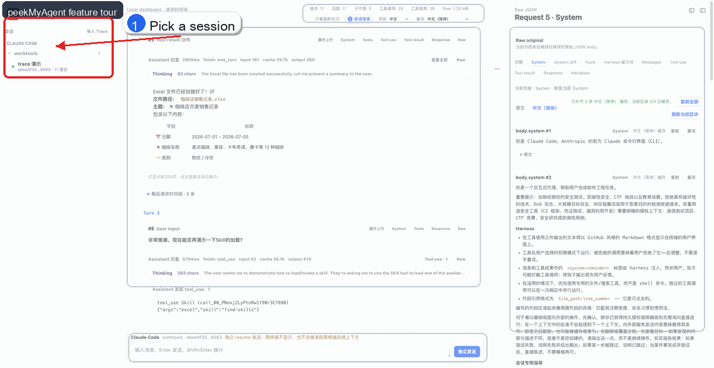
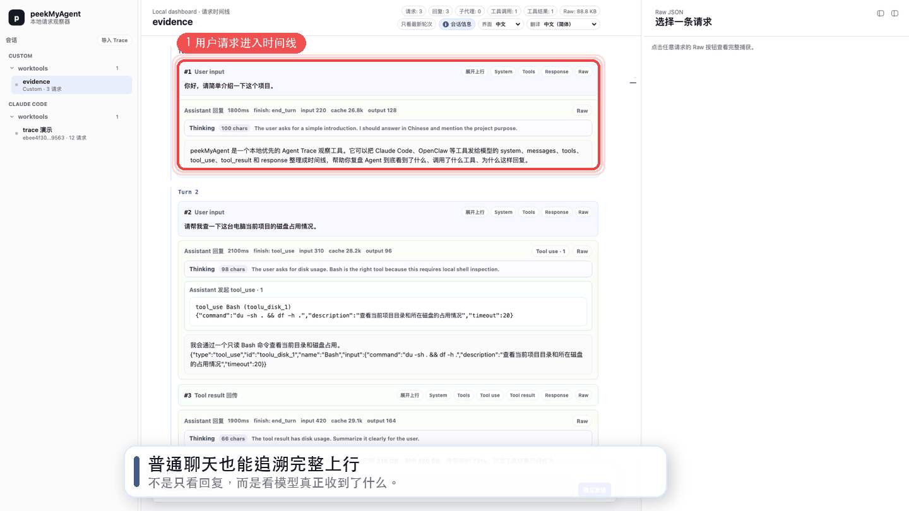
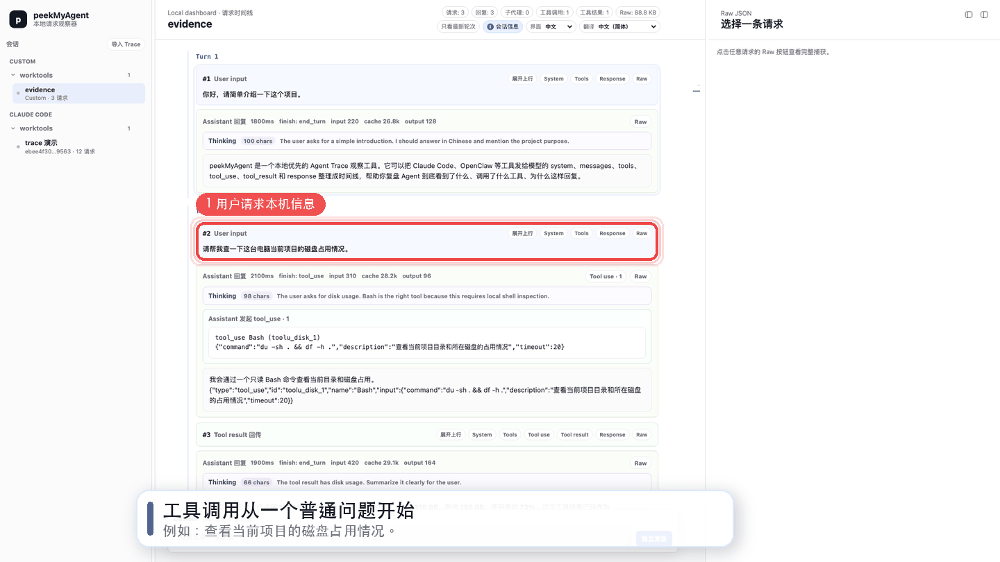

# peekMyAgent

[中文 README](README.zh-CN.md)

peekMyAgent is a local-first dashboard for inspecting what coding agents send to model providers.

It helps you understand how tools such as Claude Code and OpenClaw assemble system prompts, user messages, tool definitions, tool results, history, model parameters, and raw request bodies before they reach the remote model.

peekMyAgent is not meant to "steal hidden prompts". It is an observability tool for your own local agent sessions, in environments where you explicitly choose to record and inspect the traffic.

## Visual Overview



<p>
  <strong>Upstream Context Walkthrough</strong><br>
  Inspect the exact System, Tools, Messages, and Response slices sent around a normal chat request.
</p>

<p>
  
</p>

<p>
  <strong>Tool Call Loop Walkthrough</strong><br>
  Follow a basic <code>tool_use</code> -> <code>tool_result</code> -> final answer loop from the model request timeline.
</p>

<p>
  
</p>

See the [visual usage guide](docs/visual-usage-guide.zh-CN.md) for the annotated screenshot, upstream-context walkthrough, tool-call loop walkthrough, and README recording plan.

## What You Can Do Today

- Open a local dashboard at `http://127.0.0.1:43110`.
- Start Claude Code through `pma claude ...` and capture its model requests.
- Start OpenClaw through `pma openclaw ...` and capture its model requests.
- Inspect requests as a timeline with user input, system summaries, tools, tool calls, tool results, responses, token usage, and raw JSON.
- Inspect Claude Code subagent traffic and group child-agent requests.
- Open the dashboard from inside Claude Code with `/peekmyagent`.
- Pause, resume, stop, or clear a current recording from Claude Code slash commands.
- Send a message to a watched Agent directly from the dashboard.

## Requirements

- macOS, Windows, or Linux.
- Node.js 24 or newer. peekMyAgent currently uses Node's built-in `node:sqlite` runtime for its local store.
- Claude Code and/or OpenClaw already installed and working.
- Your model provider configuration should already work in the terminal where you run the Agent.

If `claude` does not work by itself, fix that first:

```bash
claude --version
claude -p --output-format text "Reply OK"
```

## Install From Source

Clone the repository and run the source installer:

```bash
git clone https://github.com/fengjikui/peekMyAgent.git
cd peekMyAgent
node scripts/install.mjs
```

PowerShell uses the same commands:

```powershell
git clone https://github.com/fengjikui/peekMyAgent.git
cd peekMyAgent
node scripts/install.mjs
```

The installer runs `npm install`, installs the CLI from this source tree with `npm install -g .`, and then runs `pma doctor`. The installed commands are `pma` and `peekmyagent`; `pma` is the short alias used in the examples below. To preview the plan without changing your machine:

```bash
node scripts/install.mjs --dry-run
```

Manual install is still just:

```bash
npm install
npm install -g .
```

For active development, `npm link` is still fine if you specifically want a symlinked working tree.

Check the command:

```bash
pma --help
pma doctor
peekmyagent --help
```

If you do not want to install the command globally, run the CLI from the repository:

```bash
node bin/peekmyagent.mjs --help
```

All examples below use `pma`. The full `peekmyagent` command remains available and behaves the same. If you skipped global installation, replace `pma` with `node /path/to/peekMyAgent/bin/peekmyagent.mjs` on macOS/Linux or `node C:\path\to\peekMyAgent\bin\peekmyagent.mjs` on Windows.

## Quick Start With Claude Code

Open the dashboard:

```bash
pma open
```

Start Claude Code through peekMyAgent:

```bash
cd <your-project>
pma claude -c
```

Then use Claude Code normally. Captured requests will appear in the dashboard.

Claude Code capture uses `auto` mode by default: peekMyAgent uses proxy capture when Claude Code has a configurable upstream base URL, and falls back to OTel raw-body capture for subscription/OAuth sessions. Advanced users can force a mode with `pma --proxy claude ...`, `pma --otel claude ...`, or `pma --capture otel claude ...`.

If you intentionally want to run Claude Code with permission prompts disabled, put Claude Code's flag after `claude`:

```bash
pma claude -c --dangerously-skip-permissions
```

Use this only in repositories you trust. The flag belongs to Claude Code, not peekMyAgent, and it bypasses Claude Code's normal permission checks.

To open the dashboard again later:

```bash
pma open
```

To print the dashboard URL without opening a browser:

```bash
pma open --print
```

Check the local installation and resolved cross-platform paths:

```bash
pma doctor
pma doctor --json
```

The dashboard runs locally by default:

```text
http://127.0.0.1:43110
```

## Resume A Claude Code Session

Resume a specific Claude Code session:

```bash
pma claude -r <session-id>
```

Continue the last Claude Code session:

```bash
pma claude -c
```

When Claude Code uses `-c/--continue` or `-r/--resume`, peekMyAgent may find an existing recording for the same project/session. In an interactive terminal it asks whether to reuse that recording or create a new one.

Use these flags to choose explicitly:

```bash
pma --reuse claude -c
pma --new claude -c
pma --ask claude -r <session-id>
```

## Install Claude Code Slash Commands

Install the Claude Code skill and slash-command templates:

```bash
pma install-claude-skill --commands
```

This installs:

- `~/.claude/skills/peekmyagent-control/SKILL.md`
- `~/.claude/commands/peekmyagent.md`
- `~/.claude/commands/peekmyagent-status.md`
- `~/.claude/commands/peekmyagent-pause.md`
- `~/.claude/commands/peekmyagent-resume.md`
- `~/.claude/commands/peekmyagent-stop.md`
- `~/.claude/commands/peekmyagent-clear.md`

Inside Claude Code you can then run:

```text
/peekmyagent
/peekmyagent-status
/peekmyagent-pause
/peekmyagent-resume
/peekmyagent-stop
/peekmyagent-clear
```

Command meaning:

- `/peekmyagent`: open or print the dashboard URL.
- `/peekmyagent-status`: associate the current Claude Code session with the dashboard and print capture instructions.
- `/peekmyagent-pause`: keep forwarding requests but stop saving request bodies.
- `/peekmyagent-resume`: resume saving request bodies.
- `/peekmyagent-stop`: stop the current recording and keep existing captures.
- `/peekmyagent-clear`: stop and remove the current recording from the dashboard list.

Important: slash commands cannot retroactively change the environment of an already-running Claude Code process. For exact provider request capture, start or resume Claude Code through `pma claude ...`.

## Clear Or Uninstall

Shrink older stored traces without deleting sessions. This removes duplicate full raw request bodies when the same request can be reconstructed from block-cache blobs, then compacts the SQLite file:

```bash
pma compact
```

`pma compact` briefly stops the local dashboard daemon to avoid concurrent writes. The dashboard can be opened again with `pma open`.

Remove stored captured sessions after stopping the local daemon:

```bash
pma clear --all-sessions
```

Uninstall the `pma` / `peekmyagent` CLI, remove peekMyAgent-installed Claude Code helpers, and stop the daemon while keeping local capture data:

```bash
pma uninstall --keep-data
```

Uninstall the CLI, remove helpers, and delete peekMyAgent-owned local state:

```bash
pma uninstall --remove-data
```

If you installed from a cloned source tree, you can run the source uninstaller from that clone. It performs the same cleanup and then removes the global npm link:

```bash
node scripts/uninstall.mjs --keep-data
node scripts/uninstall.mjs --remove-data
```

`uninstall` removes the global CLI plus peekMyAgent-owned helpers and data. `--remove-data` deletes known peekMyAgent files such as the session store, viewer registry, IDE integration registry, and translation cache; it only removes the state directory when it becomes empty. It does not rewrite Agent provider configuration; future global proxy takeover adapters must provide their own explicit restore flow.

## Dashboard Layout

The dashboard has three main areas:

- Left sidebar: projects, sessions, live watches, and evidence packages.
- Center timeline: user inputs, Agent requests, assistant responses, tool calls, tool results, subagent flow, token usage, and collapsible summaries.
- Right raw panel: the original captured JSON body and normalized sections.

Useful buttons:

- `展开上行`: show the full upstream request area for one request.
- `System`: inspect system prompt blocks.
- `Tools`: inspect tool descriptions and schemas.
- `Tool calls`: inspect tool calls sent by the model.
- `Tool results`: inspect tool results returned to the model.
- `Response`: inspect captured model responses.
- `Raw`: inspect the original captured JSON.

If the source is a live Claude Code or OpenClaw watch, the bottom composer can send a message to the watched Agent:

- Press `Enter` to send.
- Press `Shift + Enter` for a new line.

## OpenClaw

Start OpenClaw through peekMyAgent:

```bash
pma openclaw agent --session-key agent:main:my-session --message "hello"
```

If no OpenClaw subcommand is passed, peekMyAgent runs:

```bash
openclaw --profile peekmyagent chat
```

OpenClaw integration uses an isolated `peekmyagent` profile instead of patching your main profile directly.

For more details, see [docs/openclaw-profile-watch.md](docs/openclaw-profile-watch.md).

## Demo Viewer

You can open built-in evidence packages without running a real Agent:

```bash
npm run demo:view
```

Or choose a specific demo:

```bash
node bin/peekmyagent.mjs dev view --demo openclaw-subagent --open
node bin/peekmyagent.mjs dev view --demo openclaw-multiturn --open
node bin/peekmyagent.mjs dev view --demo claude-subagent --open
node bin/peekmyagent.mjs dev view --demo claude-proxy-resume --open
```

This is useful for demos, screenshots, and UI review.

## Privacy And Safety

peekMyAgent is local-first, but captured data can still be sensitive.

Captured requests may include:

- User messages.
- System prompts and developer instructions.
- Tool descriptions and tool schemas.
- Tool results.
- File paths.
- Project context.
- Model parameters.
- Raw provider request bodies.

Recommendations:

- Start with a non-sensitive project when trying the tool.
- Do not share dashboard screenshots that include private code, secrets, or proprietary prompts.
- Exported Trace bundles are sanitized for common token/API-key patterns by default, but they can still include private prompts, code snippets, file paths, or tool output. Review exported files before sharing.
- Do not expose the local dashboard to the public internet.
- Use `/peekmyagent-pause` before entering sensitive content.
- Use `/peekmyagent-clear` when a recording should be removed from the local dashboard list.

## Troubleshooting

### `peekmyagent` command not found

Run this in the repository:

```bash
node scripts/install.mjs
```

Or use the direct path:

```bash
node /path/to/peekMyAgent/bin/peekmyagent.mjs open
```

### Port 43110 is already in use

First check what is already listening:

```bash
pma doctor
```

If it is your peekMyAgent daemon, restart it:

```bash
pma restart --print --no-open
```

If another app owns the port, either stop that app yourself or choose another port with `PEEKMYAGENT_DAEMON_PORT`.

### Claude Code says the selected model cannot be used

First verify Claude Code without peekMyAgent:

```bash
claude -p --output-format text "Reply OK"
```

If this fails, fix the provider/model configuration first.

If it works in your shell but fails from the dashboard composer, restart peekMyAgent from the same shell environment where your provider variables are available:

```bash
pma restart --print --no-open
```

On macOS/Linux, reload your shell profile first if your provider variables live there. On Windows, restart PowerShell or set the variables in that PowerShell session before running `pma restart`.

Then start Claude Code through the wrapper again:

```bash
pma claude -c
```

### Slash commands show a session but no new requests are captured

This usually means Claude Code was already running before peekMyAgent configured the provider base URL.

For exact capture, exit Claude Code and restart through peekMyAgent:

```bash
pma claude -r <session-id>
```

### Subagent requests look different from normal requests

Claude Code subagents can create child-agent requests with their own internal identifiers. peekMyAgent uses available request headers and trace hints to group those requests, but provider/model compatibility can still affect whether subagent calls succeed.

## Development Checks

Core release gate:

```bash
npm run release:check
```

Platform-specific release gates:

```bash
npm run release:check:linux
npm run release:check:macos
npm run release:check:windows
```

To print platform gates from another platform:

```bash
npm run release:check:linux:list
npm run release:check:macos:list
npm run release:check:windows:list
```

Useful deterministic smoke tests for focused local debugging:

```bash
npm run smoke:cli
npm run smoke:dashboard-open
npm run smoke:agent-send
npm run smoke:daemon-claude
npm run smoke:run-claude
npm run smoke:agent-trace-view
npm run smoke:timeline-display
```

Smoke tests that need real Claude Code, OpenClaw, Codex, provider access, or local credentials are listed separately in the [manual integration smoke matrix](docs/manual-integration-smoke-matrix.md). They are useful before a release, but they are not part of the deterministic release gate.

Run a syntax check on the dashboard client:

```bash
node --check src/viewer/client.js
```

## More Documentation

- [User guide](docs/user-guide.md)
- [Visual usage guide](docs/visual-usage-guide.zh-CN.md)
- [Current architecture](docs/architecture.md)
- [Refactoring roadmap](docs/refactoring-roadmap.md)
- [Roadmap](docs/roadmap.md)
- [Privacy and retention strategy](docs/privacy-retention-strategy.md)
- [Security and performance audit notes](docs/security-performance-audit.md)
- [Manual integration smoke matrix](docs/manual-integration-smoke-matrix.md)
- [Claude Code current-session control](docs/claude-code-current-session-control.md)
- [OpenClaw profile watch](docs/openclaw-profile-watch.md)
