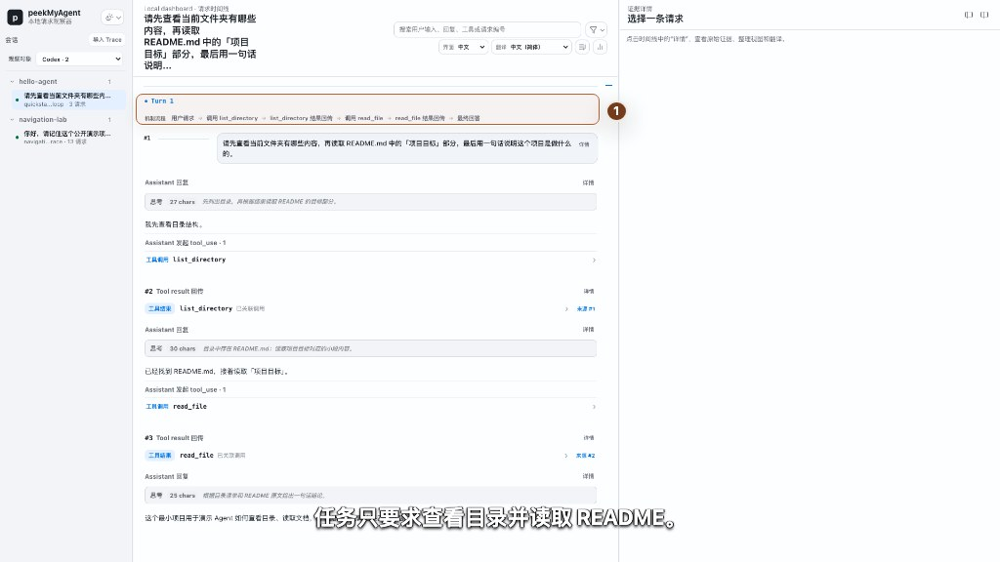

# peekMyAgent

peekMyAgent（PMA）是一个本地优先的 Agent 请求观察工作台。你仍然在 Codex、Claude Code、OpenCode、CodeBuddy 或 OpenClaw 中工作；PMA 把一次会话背后的模型请求、工具调用和上下文变化整理成可以检查、回溯的时间线。

[English](README.md) · [在线可控演示](https://fengjikui.github.io/peekMyAgent/) · [五分钟快速上手](docs/quick-start.zh-CN.md) · [完整用户手册](docs/user-guide.md)

[](https://fengjikui.github.io/peekMyAgent/?chapter=quickstart)

> 点击静态封面进入公开的十章可控 HTML 演示，支持暂停、拖动、逐镜头回看、字幕开关和全屏；GitHub README 不执行内嵌播放器，因此这里不再放需要等待循环的长 GIF。安装和操作命令继续由[五分钟快速上手](docs/quick-start.zh-CN.md)说明，本地制作入口见[演示播放器说明](assets/demo/storyboard/README.md)。

## 30 秒理解 PMA

普通日志常常只告诉你“Agent 调了一个工具”或“模型返回了一段文字”。当答案不对、工具重复调用或上下文突然变化时，你还需要知道：

- 模型这一轮实际收到了哪些 System / Developer 指令、历史消息和工具定义；
- 模型要求调用哪个工具、参数是什么，结果又在哪一轮回传；
- 最终回答依据了哪些上游证据；
- Harness 使用的是 OpenAI Responses / Chat、Anthropic Messages 还是其他协议，原始 JSON 到底是什么。

PMA 将这些信息放在同一个 Viewer 中，并保留从摘要视图回到原始协议的路径。它不是“破解隐藏提示词”的工具，只用于观察你自己授权的本地 Agent 会话。

## 五分钟开始

需要 Node.js 24 或更新版本，以及一个已经能正常工作的 Agent。

```bash
npm install --global peekmyagent@next
pma doctor
pma open
```

然后在一个**不含敏感信息的测试目录**中，通过 PMA 启动你的 Agent。以 Codex CLI 为例：

```bash
cd <your-test-project>
pma codex --dangerously-bypass-approvals-and-sandbox
```

这里使用完全权限，是为了让公开测试目录中的工具调用不中途等待审批。它会关闭 Codex CLI 的审批与 sandbox，只能用于你信任的测试目录，最好外面还有一层容器或一次性环境。其他 Harness 的对应命令及 `-c` / `-C` 区别见[五分钟快速上手](docs/quick-start.zh-CN.md#3-通过-pma-启动-agent)。

向 Agent 发送一个容易理解、又能产生工具闭环的请求：

```text
请查看当前目录有哪些文件，并读取 README.md 的开头，然后用一句话说明这个项目的用途。
```

回到 PMA Viewer：

1. 在左侧选择刚刚启动的 Source 和会话。
2. 在中间时间线依次查看用户请求、工具调用、工具结果和最终回答。
3. 点击工具结果旁的 `来源 #N`，回到产生这份结果的工具调用。
4. 点击请求旁的 `详情` 打开右侧证据栏，再查看 `System`、`Tools`、`Harness`、`History`、`Message` 和 `Metadata`；请求确有 developer message 时才会出现 `Developer`，存在可比较的前一请求时才会出现 `System diff`。
5. 用 `协议视图`核对厂商原生条目顺序；需要精确 JSON 时回到 `完整请求`，使用 Raw Inspector 搜索定位字段和完整上下行。

完整截图指引、预期画面和停止/清理方式见[五分钟快速上手](docs/quick-start.zh-CN.md)。

## 支持的 Harness

| Harness | 最短启动命令 | 观察方式 |
| --- | --- | --- |
| Codex CLI | `pma codex` | 当前进程专属的精确代理捕获 |
| Claude Code | `pma claude` | 可配置上游时精确代理；官方订阅 / OAuth 场景可回退到 OTel raw-body |
| OpenCode | `pma opencode` | 当前 CLI / TUI 进程专属的精确代理捕获 |
| CodeBuddy Code | `pma codebuddy` | 当前已验证版本的 OpenAI Chat 请求捕获 |
| OpenClaw | `pma openclaw chat` | 隔离 profile 或前缀式启动捕获 |
| 自研 Harness | `pma observe ...` | 进程级覆写 OpenAI / Anthropic compatible base URL |

Codex Desktop 还支持 `pma codex desktop` 的托管精确捕获，以及只读的 rollout 观察回退。不同 Harness 的配置边界和已验证版本见[完整用户手册](docs/user-guide.md)。

需要在受信任测试目录中录制不被审批打断的工具轨迹时，使用对应 Harness 自己的权限参数：

```bash
pma codex --dangerously-bypass-approvals-and-sandbox
pma claude --dangerously-skip-permissions
pma opencode --auto  # 显式 deny 仍然生效
pma codebuddy --dangerously-skip-permissions
```

这些不是 PMA 的提权开关。OpenCode 真正的全部允许和 OpenClaw 隔离 profile 设置，以及小写 `-c` 与 Codex 大写 `-C` 的区别，见[快速上手的启动说明](docs/quick-start.zh-CN.md#3-通过-pma-启动-agent)。

## 接入自研 Harness

如果 Harness 从环境变量读取 OpenAI-compatible 或 Anthropic-compatible 的 base URL，不必先开发专用 adapter：

```bash
# OPENAI_BASE_URL 中保存真实上游地址，通常以 /v1 结尾。
pma observe --name my-agent --base-url-env OPENAI_BASE_URL -- my-agent run

# Anthropic-compatible 示例。
pma observe --name my-agent --base-url-env ANTHROPIC_BASE_URL -- python agent.py
```

`pma observe` 只在被包装的子进程中临时覆写指定环境变量。认证 header、stdin/stdout、信号和退出码保持原样；PMA 不会在终端回显子进程参数。通用桥会识别 OpenAI Responses / Chat 与 Anthropic Messages，但不会猜测自研 Harness 的权限策略、压缩或父子 Agent 关系。

## Viewer 能回答什么

| 区域 | 适合回答的问题 |
| --- | --- |
| 时间线 / 机制流程 | 这一轮先发生了什么，工具结果何时回到模型？长会话可用 Turn / Request 两级导航。 |
| 请求详情 | 模型、温度、推理强度、System、Tools、History 分别是什么？ |
| 工具调用与结果 | 工具参数和返回值是什么，两者如何关联？ |
| 子 Agent / 多 Agent | 谁启动了子 Agent，结果何时回流，主 Agent 如何继续？ |
| 协议视图 | 厂商原生协议中的指令、消息、工具和回复是什么顺序？ |
| Raw Inspector | 摘要是否遗漏了关键字段，原始 JSON 的精确值是什么？ |
| 翻译与上下文变化 | 长提示词如何分块阅读，相邻请求增加、删除或复用了什么？ |

PMA 当前能解析 OpenAI Responses、OpenAI Chat Completions、Anthropic Messages 和 Google GenerateContent 的 Viewer 证据；具体捕获能力取决于 Harness adapter 和实际请求。

## 停止与清理

退出被 PMA 启动的 Agent 后，当前 watch 会自动停止，已捕获 Trace 会继续保留供复盘。

```bash
pma shutdown              # 停止本地 dashboard 服务，不删除 Trace
pma clear --all-sessions  # 永久清空所有已捕获会话
```

`pma clear --all-sessions` 是破坏性操作。先确认没有需要保留的 Trace，也不要把真实 Capture、提示词、源码路径或 API Key 提交到公开仓库。

## 继续阅读

- [五分钟快速上手](docs/quick-start.zh-CN.md)：第一次安装、启动、观察、停止和清理。
- [完整用户手册](docs/user-guide.md)：各 Harness 的捕获方式、完全权限模式和故障排查。
- [图文与演示素材说明](docs/visual-usage-guide.zh-CN.md)：镜头脚本、假数据来源、帧时长和重生成方法。
- [新 Harness 适配工作手册](docs/new-harness-adaptation-playbook.md)：通用协议桥不够时如何建立专用 adapter。
- [隐私与保留策略](docs/privacy-retention-strategy.md)：Capture、翻译、导入导出和公开分享前的检查。

## 从源码运行

```bash
git clone https://github.com/fengjikui/peekMyAgent.git
cd peekMyAgent
node scripts/install.mjs
pma doctor
```

只想预览安装计划时使用 `node scripts/install.mjs --dry-run`。开发者入口、架构和验证约定见 [AGENTS.md](AGENTS.md) 与 [docs/codebase-map.md](docs/codebase-map.md)。
