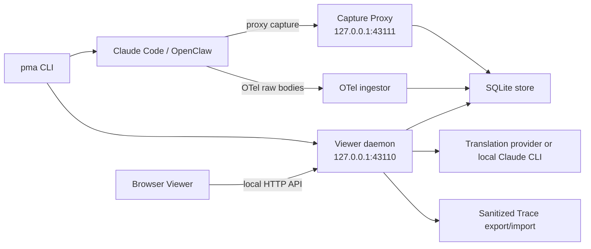
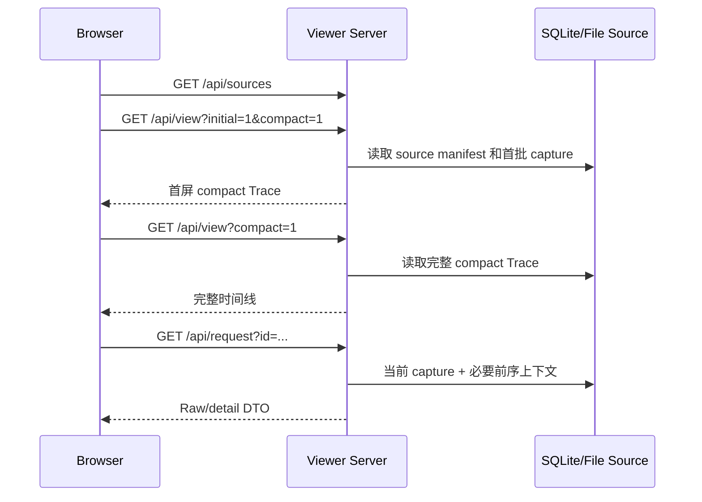

# peekMyAgent 当前架构

更新时间：2026-07-14

本文描述当前代码真实运行方式。它是维护者和贡献者理解仓库的事实源，不是未来架构愿景；需要快速定位改动位置的 Coding Agent 先读[代码库地图](codebase-map.md)，演进计划见[重构路线图](refactoring-roadmap.md)。

## 产品边界

peekMyAgent 是一个本机优先的 Coding Agent Trace 观测工具。它通过代理或 Agent 自带的调试/遥测能力获取模型请求和回复，将其持久化为可检索的 Trace，并在浏览器中展示 system prompt、tools schema、messages、`tool_use`、`tool_result`、response、子 Agent 关系和原始 JSON。

默认安全边界是“用户信任的本机”：daemon 和 capture proxy 只绑定 loopback。浏览器跨站访问会被拒绝，但 intent header 只是误调用防护，不是对本机恶意进程的身份认证。

## 运行时全景

daemon、Viewer HTTP API 和静态资源服务由同一个 `startViewerServer()` 实例提供。共享 Capture Proxy 在配置了 capture port 时由该进程一并启动，但监听独立端口。

Viewer 的 Source 列表已经通过 `SourceRepository` 汇聚四类 provider。HTTP 路由读取并校验 JSON 后，将 rename、pin、archive、delete 和项目批量操作交给 `SourceLifecycleService`；该 service 只通过显式 runtime、SQLite、metadata 和 imports 端口执行副作用。模型下行 JSON/SSE、上行消息语义以及请求协议/provider/source 画像已由 Trace Domain 统一解释；Trace 内容组装、watch 创建/恢复和其他 Viewer domain 仍在 `server.mjs`，尚未完成拆分。

## 源码地图

| 路径 | 职责 |
| --- | --- |
| `bin/peekmyagent.mjs` | CLI 命令路由、daemon 生命周期、Claude/OpenClaw wrapper、doctor、维护和卸载编排 |
| `src/core/capture-proxy.mjs` | HTTP 转发、请求/响应截获、大小和请求边界 |
| `src/core/otel-capture.mjs` | 扫描 Claude Code OTel raw-body dump、关联 request/response 并生成 capture |
| `src/core/otel-events.mjs` | 提取 OTel raw-body log events 和 trace/span 关联字段 |
| `src/core/provenance.mjs` | Capture 内容来源与关联置信度运行时契约 |
| `src/core/persistence-store.mjs` | SQLite schema、watch/capture、内容 blob 和 request tree 持久化 |
| `src/persistence/migrations/` | SQLite schema version、顺序 migration runner 和结构校验 |
| `src/core/normalize.mjs` | 归一化 capture 的基础结构，目前主要由 CLI/实验脚本使用 |
| `src/core/platform.mjs`、`paths.mjs`、`processes.mjs` | 跨平台路径、命令、进程和本机运行环境 |
| `src/core/redaction.mjs` | Trace 导出等路径使用的敏感内容脱敏 |
| `src/server/http.mjs` | Viewer method/intent/body/loopback 安全边界与统一 HTTP 响应 |
| `src/server/source-repository.mjs` | live、SQLite、file/demo、import source 的汇聚、校验与解析门面 |
| `src/server/*-source-provider.mjs`、`source-text.mjs` | live、file/demo、portable Trace、SQLite provider 与共享 Source 文本约束 |
| `src/server/source-metadata.mjs` | Source 稳定别名、title/pin/hidden 元数据、原子 sidecar 持久化与统一展示装饰 |
| `src/server/source-lifecycle-service.mjs` | 单 source/项目级 rename、pin、archive、delete 编排及 imported Trace 目录边界 |
| `src/server/source-capture-reader.mjs` | live/SQLite/file 的首屏、请求窗口与导出 captures 统一读取协议 |
| `src/server/trace-bundle-service.mjs` | Trace 导出脱敏压缩、导入验证、provenance 和私有落盘边界 |
| `src/trace/content-parts.mjs` | 上行/下行共用的 content、thinking、tool use 与 tool result 最小协议原语 |
| `src/trace/message-semantics.mjs` | 真实用户输入、命令、Harness 注入、工具结果与任务/子 Agent 回流语义 |
| `src/trace/request-profile.mjs` | System 提取、协议/provider 能力画像以及 main/subagent/parent-spawn/metadata 来源提示 |
| `src/trace/model-response-normalizer.mjs` | Anthropic/OpenAI-compatible JSON/SSE 流事件、usage、stop reason 与完整回复 DTO 归一化 |
| `src/trace/message-equivalence.mjs`、`context-delta.mjs`、`turn-timeline.mjs`、`subagent-graph.mjs` | 消息等价、context chain、历史复用、Turn 编组与多 Agent 血缘图协议 |
| `src/translation/blocks.mjs`、`hash.mjs`、`materials.mjs` | 跨 Server/Client/脚本共享的翻译块规范化、key、marker、schema 遍历、材料去重与限额 |
| `src/translation/service.mjs` | 翻译材料/manifest 私有落盘、缓存 alias 查找、并发/force 参数与翻译脚本编排 |
| `src/adapters/claude-code-otel.mjs` | Claude Code OTel 数据归一化 |
| `src/adapters/openclaw-config.mjs`、`openclaw-normalize.mjs` | OpenClaw profile 配置和协议归一化 |
| `src/adapters/trae-cn-integration.mjs` | Trae CN 配置发现、启停、漂移检查和稳定路由 |
| `src/viewer/server.mjs` | Viewer HTTP/control plane、source/watch、Trace 解释、翻译路由和 Agent send 适配 |
| `src/viewer/client.js` | 浏览器应用装配、共享状态、数据加载和尚未迁出的 feature renderer |
| `src/viewer/api-client.js` | 浏览器 `/api/*` URL、method、intent header、body 与错误协议门面 |
| `src/viewer/client-store.js` | source/Turn/request、Raw、语言、布局和 latest-only 的最小可订阅状态边界 |
| `src/viewer/pane-layout-model.js` | 三栏宽度上下限、可用空间和内容占比的纯几何模型 |
| `src/viewer/pane-layout-controller.js` | 三栏折叠、宽度偏好、键盘/指针拖动和窗口变化的长期 DOM Controller |
| `src/viewer/ui-i18n.js` | Viewer 中英文 UI 资源、默认语言、fallback 与占位符插值纯函数 |
| `src/viewer/trace-timeline-model.js` | Trace 查询分类、命中 Turn、结果上限、latest-only 与中栏窗口的纯 View Model |
| `src/viewer/trace-timeline-renderer.js` | Trace 查询栏、空状态、窗口边界和 Turn 容器编排的依赖注入 HTML renderer |
| `src/viewer/trace-timeline-controller.js` | Timeline 查询输入法生命周期、单次事件委派、活动态同步与应用动作端口 |
| `src/viewer/request-card-renderer.js` | 请求卡外壳、上行标题/快捷动作、工具交换和 Assistant 回复的纯 HTML renderer |
| `src/viewer/agent-graph-model.js` | Turn 内子 Agent 分支筛选、分页、稳定编号/颜色、状态统计与交错事件流 View Model |
| `src/viewer/agent-graph-renderer.js` | 多 Agent 摘要、流程卡、事件顺序、筛选和分支详情的纯 HTML renderer |
| `src/viewer/upstream-detail-model.js` | System、Tools、历史消息、当前新增消息/子 Agent 回流与厂商 token 口径的上行详情 View Model |
| `src/viewer/upstream-detail-renderer.js` | 上行详情折叠区的纯 HTML renderer；普通文本转义，子 Agent 结果使用受限 Markdown |
| `src/viewer/agent-composer-model.js` | 底部 Agent 发送的 source 能力、目标、警示、发送结果与表单状态 View Model |
| `src/viewer/agent-composer-renderer.js` | Agent Composer 的纯 HTML renderer |
| `src/viewer/agent-composer-controller.js` | 按 source 隔离草稿/发送状态，长期管理 Enter/IME 和 detached resume 发送生命周期 |
| `src/viewer/session-navigator-model.js` | 左栏 Source 的 Agent/项目分组、跨平台项目名、活动态、可用性和菜单 View DTO |
| `src/viewer/session-navigator-renderer.js` | Session Navigator 项目组、会话项和动作菜单的纯 HTML renderer |
| `src/viewer/session-navigator-controller.js` | 长期管理根事件委派、菜单互斥、外部关闭和项目折叠持久化 |
| `src/viewer/raw-view-model.js` | Raw Inspector 上行、下行、Harness、Metadata 的纯 section 数据与方向约束 |
| `src/viewer/raw-search-model.js` | Raw 搜索条目构建、过滤、摘要命中分段与导航索引的纯模型 |
| `src/viewer/raw-search-controller.js` | Raw 搜索输入法生命周期、延迟重绘、当前命中、高亮和滚动控制器 |
| `src/viewer/raw-inspector-renderer.js` | Raw 请求/响应导航、搜索控件与结果、详情状态和来源提示的纯 HTML renderer |
| `src/viewer/message-view-model.js` | Messages role/content/block 的规范化、结构化判定和长文本截断 DTO |
| `src/viewer/messages-renderer.js` | Messages 原文/整理切换、安全 Markdown、类型标记和结构化 Raw renderer |
| `src/viewer/translation-view-model.js` | 翻译材料分组、结构化搜索排序、缓存命中统计与展示 DTO |
| `src/viewer/translation-renderer.js` | 翻译工具栏、System/Harness 块、工具组和参数汇总的依赖注入 HTML renderer |
| `src/viewer/request-detail-cache.js` | compact request 的完整详情按需加载、并发去重、错误和 source 生命周期缓存 |
| `src/viewer/turn-rail.js` | Turn Rail 可见窗口、悬停层级、跳转和滚动激活控制器 |
| `src/server/viewer-static-assets.mjs` | Viewer 浏览器资源白名单、文件解析与 content type manifest |
| `src/viewer/markdown.js` | 受限、安全的 Markdown 渲染 |
| `src/viewer/styles.css` | 三栏应用和所有 Viewer 组件样式 |
| `integrations/` | Claude Code slash command 和 OpenClaw plugin 集成 |
| `scripts/` | 安装、卸载、确定性 smoke、真实集成实验、翻译与发布门禁 |

## Claude Code 捕获路径

### Proxy 模式

当 CLI 能找到 Claude Code 的可配置上游 base URL 时，`pma claude`：

1. 调用 `/api/watch/start` 创建或复用 watch。
2. 将子进程的 `ANTHROPIC_BASE_URL` 指向该 watch 的稳定代理地址。
3. Capture Proxy 转发原始 HTTP 请求，并在请求开始和响应完成时分别写入 SQLite。
4. Claude Code 仍直接运行在用户终端，stdin/stdout 由子进程继承。

该路径最接近网络层原始证据，但仍可能受 provider 协议差异影响。

### OTel 模式

Claude Code 的订阅/OAuth 请求可能拒绝经过改写代理。此时 CLI：

1. 为 Claude Code 注入 OTel raw-body dump 环境变量，不修改上游 URL。
2. 周期性读取临时 dump 目录。
3. 通过 `/api/capture/otel` 将新增请求和回复写入同一 SQLite store。
4. Agent 退出后完成最后一次 ingest，并删除临时目录。

OTel 的 body 来源是 Agent 官方遥测输出。wrapper 同时启用增强 OTel tracing，并把 raw-body log events 发送到 daemon 的固定 loopback 入口；watch 归属通过 `x-peekmyagent-watch-id` header 传递，不依赖 OTLP exporter 对 endpoint 查询参数的兼容性。`api_request_body` 与 `api_response_body` 若携带相同的 `traceId + spanId`，会以该关联键精确配对；同一 span 内存在多个 request attempt 时，成功 response 归属事件序号最靠后的 attempt，并标为 `high`，较早 attempt 保持无 response。旧 Claude Code、事件丢失或 exporter 不可用时，仅在进程退出的最终 ingest 中按文件写入顺序兼容回退，并明确标为 `heuristic`。

Capture 内的 `provenance` v1 将两个概念分开，完整字段与来源矩阵见 [Capture Provenance 契约](provenance-contract.md)：

- request/response artifact 的 `fidelity` 表示 JSON 正文是否来自 Agent 原始遥测文件；
- `association.confidence` 表示 request 与 response 的配对证据强度。

因此，OTel request body 可以是 `exact`，但其 response 关联仍可能是 `heuristic`。不能再用一个笼统的 `capture_confidence` 同时表达这两件事。Proxy 在请求开始时记录 request `exact`/response `missing`，响应结束后以同一 capture 生命周期更新为精确关联；响应正文若被大小上限截断，则 fidelity 为 `partial`。

当 `-c/--continue` 或 `-r/--resume` 选择复用已有监听时，OTel wrapper 会继续使用同一 `watch_id`；新一轮 dump 的 request index 从该 watch 当前最大值继续递增，从而与 proxy capture 保持一致的会话归属语义。

## OpenClaw 与其他来源

OpenClaw wrapper 会复制/补丁 profile，把选定 provider 的 base URL 临时指向 watch proxy，并在子进程退出后恢复配置。其 normalizer 保留 Capture Proxy 写入的 provenance；老 proxy capture 缺少该字段时按实际 capture 结构补齐。Trae CN 集成通过本机 `workspaceStorage`/`state.vscdb` 查找模型配置并提供可逆 patch。

Codex debug、JSONL、evidence 文件、demo fixture 和导入 Trace 也能成为 Viewer source。导入 Trace 会保留已有合法 provenance；旧 bundle 没有 provenance 时补充 `trace_import`，并把同一导入 capture record 的 request/response 关联保守标为 `high`，不反推原始捕获方式。尚未形成 CaptureRecord 的来源仍通过 source 类型和分析报告区分，不能假定为网络层原始证据。

## 持久化与内容寻址

SQLite 使用 WAL，核心实体为：

- `watches`：一次监听/运行上下文及其状态。
- `model_requests`：capture 的请求元数据、请求其余字段和响应摘要。
- `content_blobs`：按 hash 去重的 system、tool、message 内容块。
- `request_tree_nodes`：父子请求和 Agent 树关系。
- `response_blobs`：较大的响应内容。

Anthropic 风格请求的顶层 `system`、`tools`、`messages` 会拆成 blob 引用，从而避免长会话重复保存完整上下文。历史数据可通过 `pma compact` 迁移到该布局。

数据库使用 `PRAGMA user_version` 记录 schema 版本，当前版本为 1。打开数据库时，migration runner 会先在单个事务中顺序执行所有 pending migration，再校验必需表和字段，成功后才切换 WAL；未标版本的现有数据库会以不重写业务数据的方式认领 v1。任一步失败会整体回滚，高于当前程序支持版本的数据库会被拒绝打开，避免旧版本误写新 schema。新增或修改表结构必须增加新 migration，不再直接把 DDL 塞回 store 构造函数。维护流程见 [数据库迁移指南](database-migrations.md)。

当前边界：

- OpenAI Responses 风格 `input` 尚未获得完全等价的语义分块。
- response 更新会重新计算 blob refcount，长库写入有进一步优化空间。
- imported/file-backed source 仍依赖完整文件读取和 JSON parse。

详见 [Block cache 存储设计](block-cache-storage.md)。

## Viewer 数据路径

首屏默认只取前 32 个请求；随后客户端在短延迟后加载完整 compact Trace。时间线超过阈值时只渲染一个窗口，点开 Raw/细节再按 request 获取详细内容。

折叠状态是实际渲染边界，而不只是 CSS 隐藏：幕后请求时间线在展开前不创建 request card；多 Agent 看板在展开前只创建摘要；打开看板后首批只创建 24 个分支和最多 80 个事件；单个子 Agent 的步骤只在该分支展开后创建。这个边界避免大量不可见节点阻塞长 Trace 的主线程。

多 Agent 看板可按运行中、已完成未回流、已回流筛选；筛选后只生成当前状态的分支和事件。Trace 顶层搜索索引派生摘要而不是 Raw body，可按异常、慢请求、工具和子 Agent 定位请求。结果以 Turn 为归属、以命中请求为证据，每次最多追加 24 条，避免搜索本身重新制造超大 DOM。主栏使用容器条件适配真实栏宽，三栏拖拽或折叠不会再把标题挤成竖排。

Raw Inspector 的分类标签、当前区块搜索和原文/翻译操作组成同一个粘性控制区。原文模式只搜索原始 JSON 路径和值；整理/翻译模式只搜索当前可见的结构化 system、harness 或工具文本，并筛选原有块和工具组。匹配计数以可见关键词的实际出现次数为准，上一个/下一个按钮逐词循环定位并强化当前高亮。Tools 的批量复制按工具分组，显式保留工具名、工具说明和参数名，避免脱离界面后失去 schema 归属。

搜索的递归条目、大小写无关过滤、特殊字符转义、摘要窗口、高亮分段和循环索引由 `raw-search-model.js` 统一；DOM 层只负责把纯模型结果渲染为 `mark` 并滚动到当前可见命中。这样搜索语义可以脱离浏览器直接做契约测试。

顶部 Trace 搜索和 Raw 区块搜索均遵守浏览器 IME composition 生命周期：中文、日文、韩文等输入法组词期间不替换输入框 DOM，只有选词完成后才触发过滤和重绘。

Turn Rail 已作为首个 Viewer Client feature 从全局脚本迁出。`client.js` 只注入当前 Turn 集合、active id、文案和状态回调；窗口密度、边缘提示、悬停层级、点击跳转与滚动激活由 `TurnRailController` 所有。纯窗口策略和滚动选择规则有独立契约测试，后续 feature 也应遵循“依赖注入、纯策略可测、应用层只装配”的边界。

Viewer 的浏览器请求统一通过 `ViewerApiClient`。它集中定义 source/view/request/translation/import/export/send/watch API 的 URL 编码、method、Content-Type、intent 和错误传播；它不持有界面状态，也不操作 DOM。Server 继续承担最终的 loopback 与请求意图校验。

Viewer 的核心选择和偏好状态已经由最小 `ViewerClientStore` 所有。当前涵盖 source/Turn/request 选择、Raw section/mode、UI 与目标翻译语言、三栏开关/宽度和 latest-only。Store 只提供原子 patch、领域写入约束和带 `changedKeys` 的订阅通知，不访问 DOM、网络或 `localStorage`；`client.js` 暂时复用同一 state 引用读取，并继续装配副作用。受管字段禁止再直接赋值；活动 Turn/request 已由 Store 通知统一同步 DOM 和 Turn Rail。详细契约见 [Viewer Client Store 契约](viewer-client-store-contract.md)。

三栏布局的状态仍由 `ViewerClientStore` 所有，宽度约束和内容占比由纯 `pane-layout-model.js` 计算，`PaneLayoutController` 只长期管理折叠按钮、resizer、ARIA、CSS 变量和 `localStorage` 偏好。应用层注入 Store 写入端口、翻译函数以及 Turn Rail/窗口回调；Controller 不访问网络或全局 state。折叠左栏时 Raw 栏按中间内容区占比重新分配，指针、鼠标和键盘调整共享同一宽度入口，窗口变化会重新钳制两侧宽度。详细边界见 [Viewer Pane Layout Controller 契约](pane-layout-controller-contract.md)。

Viewer UI 文案由纯 `ui-i18n.js` 集中所有，当前支持 `zh-CN` 与 `en-US`。应用层的 `t()` 只委托语言选择、fallback 和占位符插值，不再持有资源表。`viewer-i18n-contract-smoke.mjs` 检查两种语言键集合与占位符完全一致、值非空，并扫描 Viewer JavaScript 与 HTML 中的静态 key 引用。目标翻译语言仍是另一套独立产品设置，不与 UI 语言资源混用。详细契约见 [Viewer UI 国际化契约](viewer-i18n-contract.md)。

Trace Timeline 的搜索分类、命中计数、结果上限、latest-only 和 Turn 窗口由纯 `trace-timeline-model.js` 计算。查询栏、空状态、窗口边界与 Turn 容器编排由 `trace-timeline-renderer.js` 生成；`TraceTimelineController` 长期持有查询栏和 Timeline 根节点，通过一次事件委派处理 IME、筛选、Raw、Agent 跳转、折叠与活动态同步。请求卡外壳、上行标题/快捷动作、当前工具交换和 Assistant 回复 HTML 由 `request-card-renderer.js` 生成。多 Agent 看板由 `agent-graph-model.js` 按 Trace Domain 已确认的分支关系计算筛选、分页和交错事件流，再由 `agent-graph-renderer.js` 生成 HTML；看板不自行推断 parent/child。上行详情由 `upstream-detail-model.js` 把完整 request 规范成 System、Tools、历史消息、当前新增消息/子 Agent 回流和 provider token DTO，再由 `upstream-detail-renderer.js` 生成 HTML；request-detail cache、展开状态与局部重绘仍由应用层所有。左侧 Session Navigator 由纯 Model/Renderer 与长生命周期 Controller 组成；Controller 持有菜单和折叠偏好，通过动作端口把选择、归档、删除、重命名和导出交回应用层。底部 Agent Composer 同样使用纯 Model/Renderer 与 Controller；Controller 按 source 隔离草稿和发送结果，通过注入的 API/刷新回调执行 detached resume，不读取全局 state。应用层先完成请求类别、详情状态、翻译动作、响应折叠和交互状态等业务决策，再注入显式 DTO 与受信任子块。renderer 不读取全局 state、不注册动作，也不访问 DOM。应用渲染仍分成 Header、Timeline 和 Composer 三个表面：Timeline 内部动作只重建 Timeline，翻译 Raw 块只刷新 Raw，翻译 Thinking 块只刷新 Timeline；source 装载、完整数据刷新、全局错误状态和 UI/目标翻译语言切换仍可使用组合 `renderAll()`。详细契约见 [Viewer Timeline 模型与局部渲染契约](viewer-timeline-contract.md)、[请求/回复卡片 Renderer 契约](request-card-renderer-contract.md)、[多 Agent 看板 View 契约](agent-graph-view-contract.md)、[上行详情 View 契约](upstream-detail-view-contract.md)、[Session Navigator View 契约](session-navigator-view-contract.md)和[Agent Composer View 契约](agent-composer-view-contract.md)。

compact 首屏后的完整 request 由 `RequestDetailCache` 按需读取。同一 request 的并发展开共享 Promise，失败可重试，source 切换统一清空；首次加载和缓存命中的应用副作用通过回调注入，缓存层不反向依赖 DOM、全局 state 或翻译模块。

Raw Inspector 的请求/响应方向由 `raw-view-model.js` 统一。它从完整上行和 Metadata 移除 response 派生字段，单独组织完整 Response 与 capture facts，并通过调用方注入 Harness 材料，避免 renderer 各自重新解释同一份 DTO。

Raw Inspector 按数据方向组织证据：请求卡和上行视图只展示 System、Tools、Harness、Messages、历史 `tool_use` 与回传的 `tool_result`；“完整请求”和“请求 Metadata”会从 capture 中剔除 response、响应状态以及 response 派生统计。请求侧标签保持单层排列，完整请求在首位、Metadata 在末位。完整 Response 与本次响应的 `tool_use` 只从 Assistant 回复进入“模型下行”视图。Assistant 视图保留独立的“上行参考”Tools schema，并明确它不是 response body 返回内容。

Raw Inspector 的结构化翻译视图已经拆为纯 View Model 和 Renderer。View Model 只接收显式材料、查询词和译文 lookup 回调，负责工具分组、命中排序、缓存统计与展示 DTO；Renderer 只接收 DTO、i18n、Markdown/Pre renderer 和 action id 注册回调。缓存 Map、网络请求、活动 request/section 与动作生命周期仍由 `client.js` 装配，因此新模块不会重复翻译 hash，也不会隐藏副作用。详细边界见 [Viewer 翻译视图契约](translation-view-renderer-contract.md)。

这改善了首屏和 DOM 成本，但不等于真正分页：后台仍会读取、传输和解释完整 Trace，并触发第二次整体渲染。最小 client store 已建立状态所有权，但尚未成为 normalized entity store。大 Trace 的下一阶段优化仍应围绕 turn/cursor API、分页实体合并和 Raw DOM 懒展开。

## Trace 解释模型

Viewer 会从 capture 中派生：

- 用户可见输入与 harness 注入内容。
- system/tools/messages 结构和上下文占比。
- 当前响应中的 `tool_use`，以及后续上行中的 `tool_result`。
- 完整 response、thinking、stop reason 和 token usage。
- 主 Agent、子 Agent、spawn/return 和事件时间线。
- 相邻上下文的新增消息、system diff 和工具变化。

模型下行的 JSON/SSE、thinking、text、tool use 和 stop reason 已由 `src/trace/model-response-normalizer.mjs` 统一归一化，详见[模型回复归一化契约](model-response-normalizer-contract.md)。上行消息分类由 `message-semantics.mjs` 统一解释；请求协议/provider 与 main/subagent/metadata 来源画像由 `request-profile.mjs` 提供，详见[Trace 请求画像契约](request-profile-contract.md)。Viewer composition 和部分 adapter-specific normalize 仍在后续收敛范围内。

## 翻译缓存

翻译对象被提取为语义块，规范化后以 `kind + "\0" + source_text` 作为 lookup key，并计算 SHA-256。Server、浏览器 Client、离线提取脚本和翻译 worker 共用 `src/translation/blocks.mjs`；Node 路径共用 `hash.mjs`，浏览器对同一 key 使用 Web Crypto，因此已有缓存 key 保持兼容。并发翻译返回通过共享 parser 解析 `@@PEEK_TRANSLATION <hash>` marker，与原块重新对齐，不依赖响应顺序。

系统支持 Markdown 感知的长块拆分、部分成功和块级重译。翻译可使用兼容 API，也可回退到本机 `claude -p`。system/harness 消息的上层语义提取仍分别依赖 Server 和 Client 的请求解释函数；后续协议 normalizer 应继续收敛这一层，但 block identity 不再重复实现。维护契约见 [翻译块协议](translation-block-contract.md)。

## Trace 分享

导出接口将 source manifest、captures 和必要元数据组织为版本化 JSON，执行常见 secret/token 脱敏后 gzip。导入会检查格式、压缩/解压大小、capture 数量和路径安全，并把文件保存为只读查看 source。

导出是“降低误分享风险”，不是内容无敏保证：prompt、代码、文件路径和工具结果仍可能包含私密信息，分享前必须人工检查。

## 本地 API 安全边界

Server 的主要路由包括 source/view/request、translation、watch 控制、Agent send、Trace import/export、OTel ingest 和 daemon lifecycle。

当前防护层：

- 默认只允许 loopback host。
- 拒绝跨站 `Origin`、`Referer` 和不合适的 Fetch Metadata。
- 只读/写入接口限制 HTTP method。
- 写入接口要求 JSON content-type。
- 高敏操作要求显式 `x-peekmyagent-intent`。
- 请求、响应、导入包、翻译材料和 OTel 扫描都有大小/数量限制。

当前不承诺防御同一台电脑上的恶意进程。详见 [安全与性能审计纪要](security-performance-audit.md)。

## 测试与发布门禁

`npm run release:check` 组合 70 余项确定性 smoke，使用隔离的 HOME、状态目录和端口，覆盖：

- CLI、doctor、安装、卸载和维护。
- proxy/OTel、watch、pause/resume、request tree 和 block cache。
- Viewer compact/detail、时间线、Markdown、安全边界和 Agent send。
- Trace import/export、翻译容错、项目级 source action。
- Linux、macOS、Windows 的平台 gate 和 GitHub Actions。

需要真实账号、provider、Claude Code、OpenClaw 或 Codex 的实验单独列在 [手动集成 smoke 矩阵](manual-integration-smoke-matrix.md)，避免让发布门禁依赖外部状态。

日常开发按 [分级测试与批次检查策略](validation-strategy.md) 执行：低风险改动逐次运行聚焦测试，最多累计 3 个代码提交；达到阈值、高风险改动或准备推送时，运行当前平台完整 profile。每次推送仍由 GitHub Actions 执行三平台矩阵。

## 维护约定

- 改动数据结构前先更新数据库迁移设计。
- 改动 API 字段时同步更新共享契约、Server、Client 和对应 smoke。
- 改动 UI 文案时同步检查中英文界面和翻译目标语言。
- 新增 capture source 时必须说明 provenance、关联方式和误判边界。
- 文档中的“当前行为”“实验结论”“未来计划”必须明确标注，避免把设计草案写成已实现能力。
