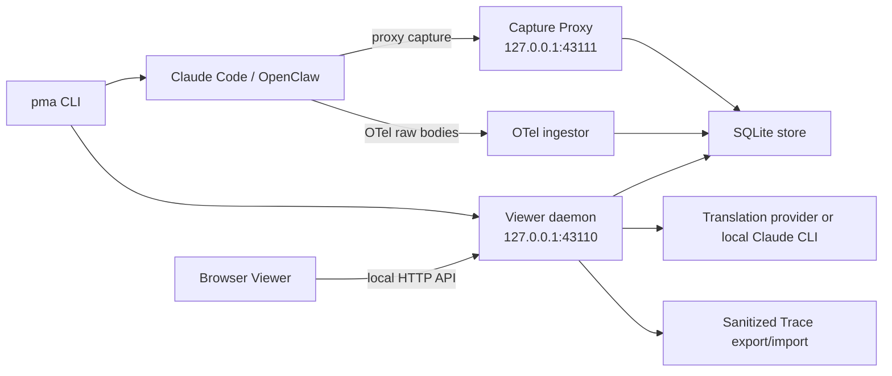
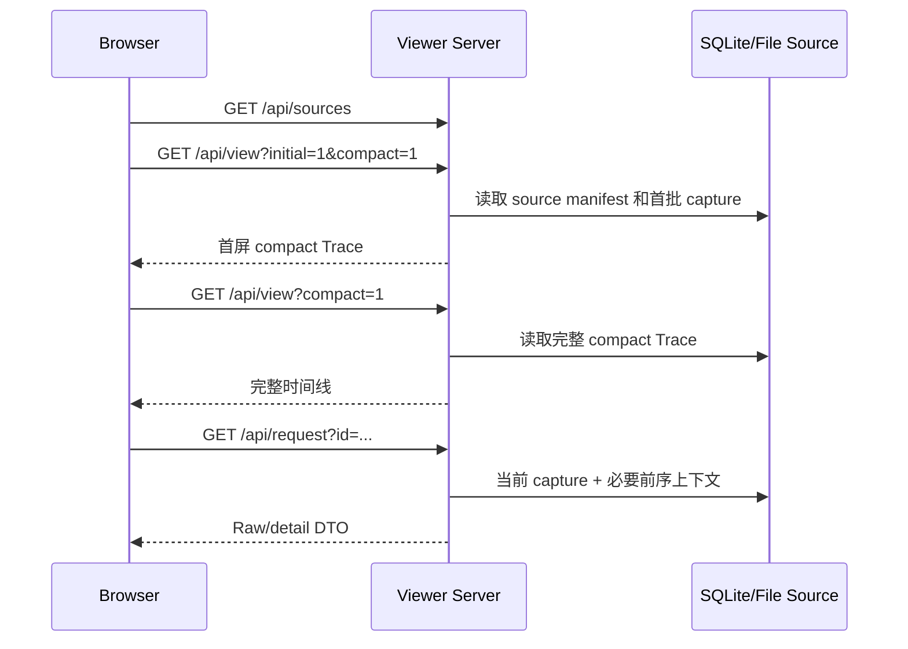

# peekMyAgent 当前架构

更新时间：2026-07-12

本文描述当前代码真实运行方式。它是维护者和贡献者理解仓库的入口，不是未来架构愿景；演进计划见 [重构路线图](refactoring-roadmap.md)。

## 产品边界

peekMyAgent 是一个本机优先的 Coding Agent Trace 观测工具。它通过代理或 Agent 自带的调试/遥测能力获取模型请求和回复，将其持久化为可检索的 Trace，并在浏览器中展示 system prompt、tools schema、messages、`tool_use`、`tool_result`、response、子 Agent 关系和原始 JSON。

默认安全边界是“用户信任的本机”：daemon 和 capture proxy 只绑定 loopback。浏览器跨站访问会被拒绝，但 intent header 只是误调用防护，不是对本机恶意进程的身份认证。

## 运行时全景

daemon、Viewer HTTP API 和静态资源服务由同一个 `startViewerServer()` 实例提供。共享 Capture Proxy 在配置了 capture port 时由该进程一并启动，但监听独立端口。

## 源码地图

| 路径 | 职责 |
| --- | --- |
| `bin/peekmyagent.mjs` | CLI 命令路由、daemon 生命周期、Claude/OpenClaw wrapper、doctor、维护和卸载编排 |
| `src/core/capture-proxy.mjs` | HTTP 转发、请求/响应截获、大小和请求边界 |
| `src/core/otel-capture.mjs` | 扫描 Claude Code OTel raw-body dump、关联 request/response 并生成 capture |
| `src/core/otel-events.mjs` | 提取 OTel raw-body log events 和 trace/span 关联字段 |
| `src/core/provenance.mjs` | Capture 内容来源与关联置信度运行时契约 |
| `src/core/persistence-store.mjs` | SQLite schema、watch/capture、内容 blob 和 request tree 持久化 |
| `src/persistence/migrations/` | SQLite schema version、顺序 migration runner 和结构校验 |
| `src/core/normalize.mjs` | 归一化 capture 的基础结构，目前主要由 CLI/实验脚本使用 |
| `src/core/platform.mjs`、`paths.mjs`、`processes.mjs` | 跨平台路径、命令、进程和本机运行环境 |
| `src/core/redaction.mjs` | Trace 导出等路径使用的敏感内容脱敏 |
| `src/server/http.mjs` | Viewer method/intent/body/loopback 安全边界与统一 HTTP 响应 |
| `src/server/source-repository.mjs` | live、SQLite、file/demo、import source 的汇聚、校验与解析门面 |
| `src/server/imported-trace-source-provider.mjs`、`source-text.mjs` | portable Trace 目录/manifest provider 与共享 Source 文本约束 |
| `src/translation/blocks.mjs`、`hash.mjs` | 跨 Server/Client/脚本共享的翻译块规范化、key、marker、schema 遍历和 Node hash |
| `src/adapters/claude-code-otel.mjs` | Claude Code OTel 数据归一化 |
| `src/adapters/openclaw-config.mjs`、`openclaw-normalize.mjs` | OpenClaw profile 配置和协议归一化 |
| `src/adapters/trae-cn-integration.mjs` | Trae CN 配置发现、启停、漂移检查和稳定路由 |
| `src/viewer/server.mjs` | Viewer HTTP/control plane、source/watch、Trace 解释、翻译、导入导出和 Agent send |
| `src/viewer/client.js` | 浏览器状态、数据加载、时间线、Raw、翻译、多 Agent 和布局交互 |
| `src/viewer/markdown.js` | 受限、安全的 Markdown 渲染 |
| `src/viewer/styles.css` | 三栏应用和所有 Viewer 组件样式 |
| `integrations/` | Claude Code slash command 和 OpenClaw plugin 集成 |
| `scripts/` | 安装、卸载、确定性 smoke、真实集成实验、翻译与发布门禁 |

## Claude Code 捕获路径

### Proxy 模式

当 CLI 能找到 Claude Code 的可配置上游 base URL 时，`pma claude`：

1. 调用 `/api/watch/start` 创建或复用 watch。
2. 将子进程的 `ANTHROPIC_BASE_URL` 指向该 watch 的稳定代理地址。
3. Capture Proxy 转发原始 HTTP 请求，并在请求开始和响应完成时分别写入 SQLite。
4. Claude Code 仍直接运行在用户终端，stdin/stdout 由子进程继承。

该路径最接近网络层原始证据，但仍可能受 provider 协议差异影响。

### OTel 模式

Claude Code 的订阅/OAuth 请求可能拒绝经过改写代理。此时 CLI：

1. 为 Claude Code 注入 OTel raw-body dump 环境变量，不修改上游 URL。
2. 周期性读取临时 dump 目录。
3. 通过 `/api/capture/otel` 将新增请求和回复写入同一 SQLite store。
4. Agent 退出后完成最后一次 ingest，并删除临时目录。

OTel 的 body 来源是 Agent 官方遥测输出。wrapper 同时启用增强 OTel tracing，并把 raw-body log events 发送到 daemon 的固定 loopback 入口；watch 归属通过 `x-peekmyagent-watch-id` header 传递，不依赖 OTLP exporter 对 endpoint 查询参数的兼容性。`api_request_body` 与 `api_response_body` 若携带相同的 `traceId + spanId`，会以该关联键精确配对；同一 span 内存在多个 request attempt 时，成功 response 归属事件序号最靠后的 attempt，并标为 `high`，较早 attempt 保持无 response。旧 Claude Code、事件丢失或 exporter 不可用时，仅在进程退出的最终 ingest 中按文件写入顺序兼容回退，并明确标为 `heuristic`。

Capture 内的 `provenance` v1 将两个概念分开，完整字段与来源矩阵见 [Capture Provenance 契约](provenance-contract.md)：

- request/response artifact 的 `fidelity` 表示 JSON 正文是否来自 Agent 原始遥测文件；
- `association.confidence` 表示 request 与 response 的配对证据强度。

因此，OTel request body 可以是 `exact`，但其 response 关联仍可能是 `heuristic`。不能再用一个笼统的 `capture_confidence` 同时表达这两件事。Proxy 在请求开始时记录 request `exact`/response `missing`，响应结束后以同一 capture 生命周期更新为精确关联；响应正文若被大小上限截断，则 fidelity 为 `partial`。

当 `-c/--continue` 或 `-r/--resume` 选择复用已有监听时，OTel wrapper 会继续使用同一 `watch_id`；新一轮 dump 的 request index 从该 watch 当前最大值继续递增，从而与 proxy capture 保持一致的会话归属语义。

## OpenClaw 与其他来源

OpenClaw wrapper 会复制/补丁 profile，把选定 provider 的 base URL 临时指向 watch proxy，并在子进程退出后恢复配置。其 normalizer 保留 Capture Proxy 写入的 provenance；老 proxy capture 缺少该字段时按实际 capture 结构补齐。Trae CN 集成通过本机 `workspaceStorage`/`state.vscdb` 查找模型配置并提供可逆 patch。

Codex debug、JSONL、evidence 文件、demo fixture 和导入 Trace 也能成为 Viewer source。导入 Trace 会保留已有合法 provenance；旧 bundle 没有 provenance 时补充 `trace_import`，并把同一导入 capture record 的 request/response 关联保守标为 `high`，不反推原始捕获方式。尚未形成 CaptureRecord 的来源仍通过 source 类型和分析报告区分，不能假定为网络层原始证据。

## 持久化与内容寻址

SQLite 使用 WAL，核心实体为：

- `watches`：一次监听/运行上下文及其状态。
- `model_requests`：capture 的请求元数据、请求其余字段和响应摘要。
- `content_blobs`：按 hash 去重的 system、tool、message 内容块。
- `request_tree_nodes`：父子请求和 Agent 树关系。
- `response_blobs`：较大的响应内容。

Anthropic 风格请求的顶层 `system`、`tools`、`messages` 会拆成 blob 引用，从而避免长会话重复保存完整上下文。历史数据可通过 `pma compact` 迁移到该布局。

数据库使用 `PRAGMA user_version` 记录 schema 版本，当前版本为 1。打开数据库时，migration runner 会先在单个事务中顺序执行所有 pending migration，再校验必需表和字段，成功后才切换 WAL；未标版本的现有数据库会以不重写业务数据的方式认领 v1。任一步失败会整体回滚，高于当前程序支持版本的数据库会被拒绝打开，避免旧版本误写新 schema。新增或修改表结构必须增加新 migration，不再直接把 DDL 塞回 store 构造函数。维护流程见 [数据库迁移指南](database-migrations.md)。

当前边界：

- OpenAI Responses 风格 `input` 尚未获得完全等价的语义分块。
- response 更新会重新计算 blob refcount，长库写入有进一步优化空间。
- imported/file-backed source 仍依赖完整文件读取和 JSON parse。

详见 [Block cache 存储设计](block-cache-storage.md)。

## Viewer 数据路径

首屏默认只取前 32 个请求；随后客户端在短延迟后加载完整 compact Trace。时间线超过阈值时只渲染一个窗口，点开 Raw/细节再按 request 获取详细内容。

折叠状态是实际渲染边界，而不只是 CSS 隐藏：幕后请求时间线在展开前不创建 request card；多 Agent 看板在展开前只创建摘要；打开看板后首批只创建 24 个分支和最多 80 个事件；单个子 Agent 的步骤只在该分支展开后创建。这个边界避免大量不可见节点阻塞长 Trace 的主线程。

多 Agent 看板可按运行中、已完成未回流、已回流筛选；筛选后只生成当前状态的分支和事件。Trace 顶层搜索索引派生摘要而不是 Raw body，可按异常、慢请求、工具和子 Agent 定位请求。结果以 Turn 为归属、以命中请求为证据，每次最多追加 24 条，避免搜索本身重新制造超大 DOM。主栏使用容器条件适配真实栏宽，三栏拖拽或折叠不会再把标题挤成竖排。

Raw Inspector 的分类标签、当前区块搜索和原文/翻译操作组成同一个粘性控制区。原文模式只搜索原始 JSON 路径和值；整理/翻译模式只搜索当前可见的结构化 system、harness 或工具文本，并筛选原有块和工具组。匹配计数以可见关键词的实际出现次数为准，上一个/下一个按钮逐词循环定位并强化当前高亮。Tools 的批量复制按工具分组，显式保留工具名、工具说明和参数名，避免脱离界面后失去 schema 归属。

顶部 Trace 搜索和 Raw 区块搜索均遵守浏览器 IME composition 生命周期：中文、日文、韩文等输入法组词期间不替换输入框 DOM，只有选词完成后才触发过滤和重绘。

Raw Inspector 按数据方向组织证据：请求卡和上行视图只展示 System、Tools、Harness、Messages、历史 `tool_use` 与回传的 `tool_result`；“完整请求”和“请求 Metadata”会从 capture 中剔除 response、响应状态以及 response 派生统计。请求侧标签保持单层排列，完整请求在首位、Metadata 在末位。完整 Response 与本次响应的 `tool_use` 只从 Assistant 回复进入“模型下行”视图。Assistant 视图保留独立的“上行参考”Tools schema，并明确它不是 response body 返回内容。

这改善了首屏和 DOM 成本，但不等于真正分页：后台仍会读取、传输和解释完整 Trace，并触发第二次整体渲染。大 Trace 的下一阶段优化应围绕 turn/cursor API、增量客户端 store 和 Raw DOM 懒展开。

## Trace 解释模型

Viewer 会从 capture 中派生：

- 用户可见输入与 harness 注入内容。
- system/tools/messages 结构和上下文占比。
- 当前响应中的 `tool_use`，以及后续上行中的 `tool_result`。
- 完整 response、thinking、stop reason 和 token usage。
- 主 Agent、子 Agent、spawn/return 和事件时间线。
- 相邻上下文的新增消息、system diff 和工具变化。

当前这些解释逻辑主要位于 `server.mjs` 和 `client.js`，没有完全复用 `src/adapters/*` 的 normalizer。它是后续建立共享协议层的首要原因。

## 翻译缓存

翻译对象被提取为语义块，规范化后以 `kind + "\0" + source_text` 作为 lookup key，并计算 SHA-256。Server、浏览器 Client、离线提取脚本和翻译 worker 共用 `src/translation/blocks.mjs`；Node 路径共用 `hash.mjs`，浏览器对同一 key 使用 Web Crypto，因此已有缓存 key 保持兼容。并发翻译返回通过共享 parser 解析 `@@PEEK_TRANSLATION <hash>` marker，与原块重新对齐，不依赖响应顺序。

系统支持 Markdown 感知的长块拆分、部分成功和块级重译。翻译可使用兼容 API，也可回退到本机 `claude -p`。system/harness 消息的上层语义提取仍分别依赖 Server 和 Client 的请求解释函数；后续协议 normalizer 应继续收敛这一层，但 block identity 不再重复实现。维护契约见 [翻译块协议](translation-block-contract.md)。

## Trace 分享

导出接口将 source manifest、captures 和必要元数据组织为版本化 JSON，执行常见 secret/token 脱敏后 gzip。导入会检查格式、压缩/解压大小、capture 数量和路径安全，并把文件保存为只读查看 source。

导出是“降低误分享风险”，不是内容无敏保证：prompt、代码、文件路径和工具结果仍可能包含私密信息，分享前必须人工检查。

## 本地 API 安全边界

Server 的主要路由包括 source/view/request、translation、watch 控制、Agent send、Trace import/export、OTel ingest 和 daemon lifecycle。

当前防护层：

- 默认只允许 loopback host。
- 拒绝跨站 `Origin`、`Referer` 和不合适的 Fetch Metadata。
- 只读/写入接口限制 HTTP method。
- 写入接口要求 JSON content-type。
- 高敏操作要求显式 `x-peekmyagent-intent`。
- 请求、响应、导入包、翻译材料和 OTel 扫描都有大小/数量限制。

当前不承诺防御同一台电脑上的恶意进程。详见 [安全与性能审计纪要](security-performance-audit.md)。

## 测试与发布门禁

`npm run release:check` 组合约 50 项确定性 smoke，使用隔离的 HOME、状态目录和端口，覆盖：

- CLI、doctor、安装、卸载和维护。
- proxy/OTel、watch、pause/resume、request tree 和 block cache。
- Viewer compact/detail、时间线、Markdown、安全边界和 Agent send。
- Trace import/export、翻译容错、项目级 source action。
- Linux、macOS、Windows 的平台 gate 和 GitHub Actions。

需要真实账号、provider、Claude Code、OpenClaw 或 Codex 的实验单独列在 [手动集成 smoke 矩阵](manual-integration-smoke-matrix.md)，避免让发布门禁依赖外部状态。

## 维护约定

- 改动数据结构前先更新数据库迁移设计。
- 改动 API 字段时同步更新共享契约、Server、Client 和对应 smoke。
- 改动 UI 文案时同步检查中英文界面和翻译目标语言。
- 新增 capture source 时必须说明 provenance、关联方式和误判边界。
- 文档中的“当前行为”“实验结论”“未来计划”必须明确标注，避免把设计草案写成已实现能力。
