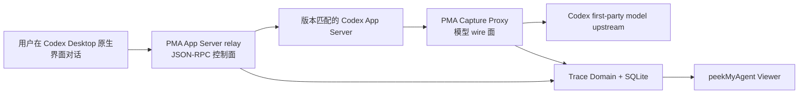

# Codex Desktop App Server Bridge 实验

日期：2026-07-19

状态：原始可行性实验已完成；后续已经实现为 `pma codex desktop` 托管精确捕获原型。真实订阅账号与原生 Desktop 重启仍需人工验收。

## 后续实现状态

本文件保留最初 App Server bridge 实验的证据与推理。后续产品实现已经增加 tokenized loopback relay、选择性 thread 路由、Capture Proxy 串联、失败恢复和确定性回归测试。2026-07-19 的进一步隔离探针还确认：`thread/start`、冷态 `thread/resume` 与 `thread/fork` 的 thread-local `config` 可以直接定义临时 `model_providers`；因此受管 App Server 无需在进程参数或全局配置中注册 PMA provider，其他 thread 不受影响。

## 实验目标

验证是否可以同时满足以下目标：

1. 用户继续在 Codex Desktop 原生界面中创建项目、发送消息和查看回复。
2. peekMyAgent 不依赖 rollout 事后重建，而是观察 Desktop 与 Codex Harness 的实时控制面。
3. 后续可以把同一受管 Codex App Server 的模型网络流量接入现有 Capture Proxy，获得逐字 request/response。
4. 不修改 Codex Desktop 安装包，不使用系统级 TLS MITM，也不把认证信息写入实验产物。

## 实验环境

| 项目 | 实验值 |
| --- | --- |
| 系统 | macOS arm64 |
| Codex Desktop | `26.707.72221`，build `5307` |
| Desktop 内嵌 Codex | `codex-cli 0.144.2` |
| 全局 Codex CLI | `codex-cli 0.134.0` |
| App Server transport | loopback WebSocket |
| 实验状态目录 | 独立临时 `CODEX_HOME` 与 Electron user-data-dir |

实验没有读取用户真实项目、真实 rollout 或认证文件，也没有向模型服务发送请求。

## 基线：Desktop 与 CLI 的关系

Codex Desktop 并不是调用用户 PATH 中的全局 `codex` CLI。当前安装会启动应用内置、版本固定的 Codex 二进制：

```text
/Applications/ChatGPT.app/Contents/Resources/codex \
  -c features.code_mode_host=true \
  app-server \
  --analytics-default-enabled
```

因此 Desktop 与 CLI 的关系是：二者共享同一个 Codex Harness/Core，但拥有不同的前端和启动生命周期。CLI/TUI 直接管理终端交互；Desktop 通过 App Server JSON-RPC 协议管理 thread、turn、item、工具和配置。

## 实验一：独立 App Server

使用 Desktop 内嵌、版本完全匹配的二进制启动隔离 App Server：

```bash
CODEX_HOME=<temporary-codex-home> \
  /Applications/ChatGPT.app/Contents/Resources/codex \
  app-server --listen ws://127.0.0.1:43299
```

独立 WebSocket client 完成 `initialize` 握手，服务返回 `0.144.2`。这证明内嵌 App Server 可以作为独立、loopback-only 的多 client 服务运行。

### 多 client 观察结果

- 新 thread 的 `thread/started` 会广播给已初始化 client。
- turn 的完整事件默认只发给发起或已订阅该 thread 的 client；另一个普通连接只能收到部分全局状态事件。
- 第二个 client 在 turn 运行期间执行 `thread/resume` 后，可以收到后续 thread/turn 事件。
- 第一个 turn 之前尚无持久 rollout 时，`thread/resume` 可能返回 `no rollout found`。

结论：sidecar 订阅在协议上可行，但可能错过订阅前的早期 turn 事件。若目标是无遗漏捕获，透明处于 Desktop 与 App Server 之间比旁路猜测订阅时机更可靠。

## 实验二：Desktop 切换到受管 App Server

对当前 Desktop 包进行只读静态检查，确认存在以下启动时入口：

- `CODEX_APP_SERVER_WS_URL`
- local host config 的 `websocket_url`
- `CODEX_APP_SERVER_USE_LOCAL_DAEMON`
- `CODEX_APP_SERVER_FORCE_CLI`

这些是当前包内实现，不是长期稳定的公开产品 API。正式 adapter 必须按 Desktop 版本做能力探测，并在入口消失时给出可解释降级。

使用独立 Electron profile 启动第二个 Desktop 实例：

```bash
CODEX_HOME=<temporary-codex-home> \
CODEX_ELECTRON_USER_DATA_PATH=<temporary-profile> \
CODEX_APP_SERVER_WS_URL=ws://127.0.0.1:43299 \
  /Applications/ChatGPT.app/Contents/MacOS/ChatGPT \
  --user-data-dir=<temporary-profile>
```

真实日志确认：

```text
Starting app-server connection hostId=local transport=websocket
Transport start success connectionId=1 hostId=local transport=websocket
Current reported app-server version: currentVersion=0.144.2
initialize_handshake_result ... outcome=success transportKind=websocket
Codex CLI initialized
... next=connected ... transport=websocket
```

进程树中只有 Electron renderer/service 进程，没有该 Desktop 私自启动的第二个 `codex app-server`。因此已经证明：**原生 Desktop UI 可以连接到 peekMyAgent 管理的 App Server。**

## 实验三：透明 WebSocket 中继

在 Desktop 与受管 App Server 之间加入一个不修改 payload 的 loopback WebSocket relay：

```text
Codex Desktop
    -> ws://127.0.0.1:43300  PMA relay
    -> ws://127.0.0.1:43299  managed Codex App Server
```

连接状态同时观察到：

- Desktop -> relay：`ESTABLISHED`
- relay -> App Server：`ESTABLISHED`
- App Server：仅绑定 `127.0.0.1`

Desktop 正常完成启动和初始化。中继共记录 97 个双向 JSON-RPC frame：

| 方向 | 数量 |
| --- | ---: |
| Desktop -> App Server | 48 |
| App Server -> Desktop | 49 |

可观察方法包括：

- `initialize`
- `thread/list`
- `model/list`
- `config/read`
- `account/read`
- `experimentalFeature/list`
- `plugin/list`
- `collaborationMode/list`
- `mcpServerStatus/list`

请求 ID、成功 response 和 error response 均能双向关联。relay 未修改 frame，Desktop 的初始化握手和后续调用均成功。

## 已证明与未证明

### 已证明

1. Desktop 和 CLI 共享 Codex Harness，但 Desktop 使用内嵌 App Server，不是简单调用全局 CLI/TUI。
2. 当前 Desktop 可以在启动时连接到指定 loopback WebSocket App Server。
3. 原生 Desktop UI 与 PMA 透明 JSON-RPC relay 可以同时工作。
4. relay 能无遗漏地观察经过它的 App Server 请求、回复和通知，优于依赖第二 client 的迟到订阅。
5. 受管 App Server 与现有 HTTP Capture Proxy 可以组成两个互补证据面。

### 尚未证明或不能宣称

1. 不能在不重启的情况下修改一个已经运行的 Desktop 进程环境和现有 stdio 连接。
2. 本轮没有使用真实账号执行模型 turn，因此没有把“Desktop UI -> JSON-RPC relay -> App Server -> Capture Proxy -> first-party model upstream”在一次认证会话中串成完整闭环。
3. JSON-RPC relay 观察的是 Harness 控制面，不等同于逐字模型 HTTP/WebSocket request/response。
4. `CODEX_APP_SERVER_WS_URL` 是当前包内入口，不应未经版本探测就承诺为永久公共接口。
5. Windows/Linux Desktop 的 launcher、profile lock 和进程生命周期仍需真实平台验证。

网络层的真实 first-party Responses WebSocket、HTTP fallback、多轮历史和工具结果回传已经在独立深度代理实验中验证；本实验补齐的是 Desktop 原生交互与受管 App Server 之间的缺口。

## 推荐产品架构



两条证据不能互相替代：

- App Server relay 保存 thread/turn/item、工具审批、interrupt、动态配置和 Harness lifecycle。
- Capture Proxy 保存真正发给模型的 instructions、tools、input、compact request 和完整 response。
- rollout 只作为可选恢复与交叉核验来源，不再是精确 Desktop 捕获的基础依赖。

## 建议的用户流程

当前已经提供入口：

```bash
pma codex desktop
```

建议生命周期：

1. 检测 Desktop 版本、内嵌 Codex 版本和 App Server WebSocket 能力。
2. 若 Desktop 已运行，解释需要受管重启；不尝试注入或劫持现有进程。
3. 启动 loopback Capture Proxy、版本匹配 App Server 和 JSON-RPC relay。
4. 以临时环境覆盖启动原生 Desktop，不永久修改用户配置。
5. 用户仍在 Desktop 中正常工作；PMA 自动打开对应看板。
6. 退出后关闭 relay、App Server 和 watch，并恢复临时资源。

产品文案应称为“受管 Desktop 精确捕获”，而不是“附着到任意已运行 Desktop”。

## 安全要求

- 所有监听默认只绑定 loopback，并使用随机高熵会话 token 或等价的本机连接认证。
- relay 不应默认持久化所有控制帧；先按 schema 提取允许字段，再走现有 redaction、大小上限与内容寻址存储。
- `account/read`、登录、设备授权、MCP 密钥和 provider 认证值不得进入 Trace 或诊断日志。
- App Server 必须与 Desktop 内嵌版本匹配，不能静默使用 PATH 中的旧 CLI。
- 启动失败时保持用户原 Desktop 和配置可用，不能留下全局 provider 或系统代理修改。

## 剩余验收门槛

以下部分已经由 fake Desktop/App Server/upstream 和真实内嵌 App Server 无模型请求探针覆盖：选择性 thread 路由、thread-local provider 注入、frame/UTF-8/mask/压缩校验、背压、正常关闭映射、失败清理以及 exact request/response 同轮关联。

尚待完成：

1. 从外部系统终端使用真实订阅账号执行一次经用户同意的 Desktop 重启，确认只复用现有认证且不会记录或导出认证值。
2. 实测 Desktop 已运行、正常退出、崩溃和 PMA 中途退出后的原生重开体验。
3. 验证新 thread、显式选择的既有 thread 冷恢复及无关并行 thread 三种真实 UI 场景。
4. 在 Windows 上研究和验证受管 Desktop 启动；Linux 以实际可用 Codex 形态单独定义支持边界。
