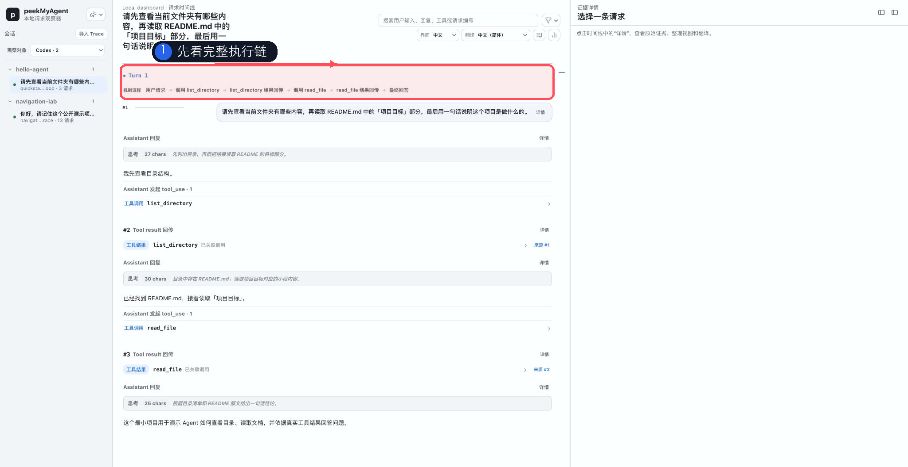
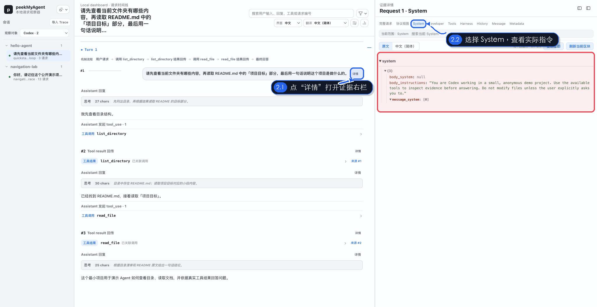
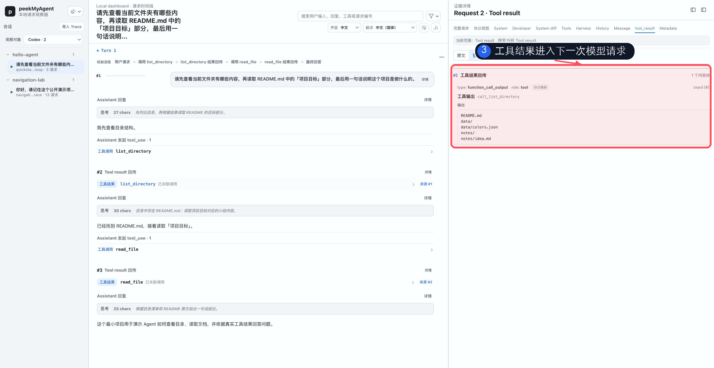
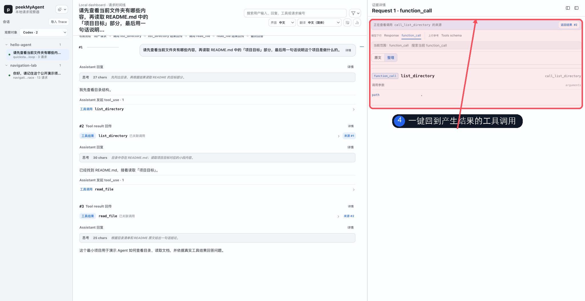
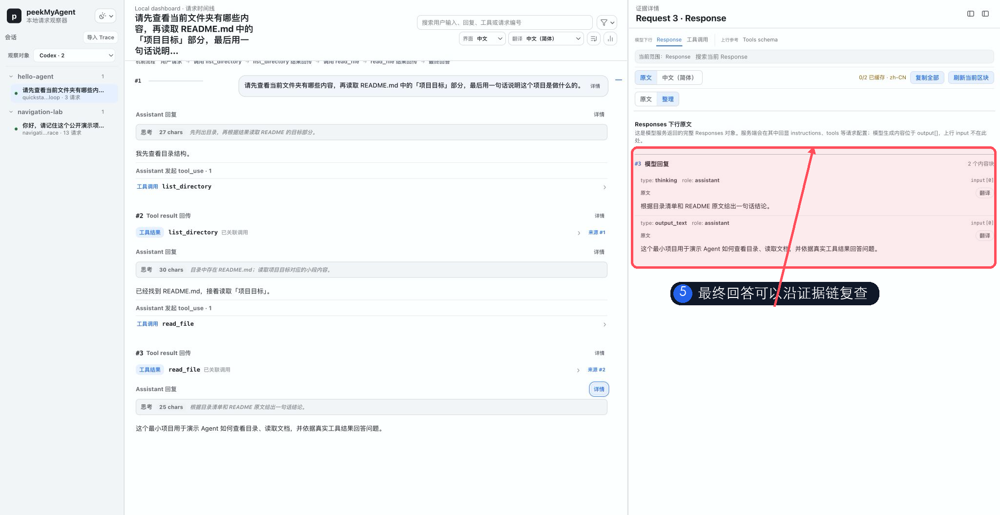
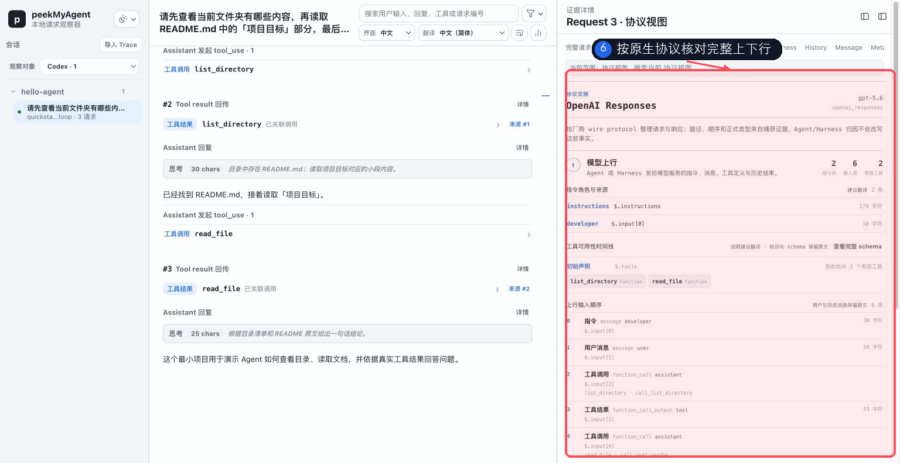
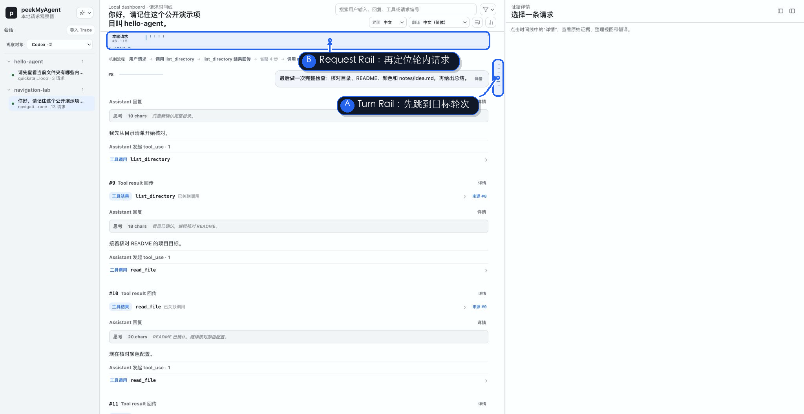

# peekMyAgent 五分钟快速上手

这篇指南只完成一件事：用一个没有项目背景、没有敏感信息的小任务，第一次看清 Agent 如何从用户请求走到工具调用、工具结果和最终回答。

PMA 不替代 Agent，也不替你判断答案一定正确。它把 Harness 与模型之间的请求、工具交换、结果回传和原始协议整理成一条可以逐步检查、随时回溯的证据链；普通日志里一句“工具已调用”，在这里可以继续追到模型实际收到的上下文和下一次请求。

完成后，你会得到这样一条可回溯的执行链：

```text
用户请求
  → 模型决定查看目录
  → list_directory 工具结果回传
  → 模型决定读取 README.md
  → read_file 工具结果回传
  → 模型给出有依据的最终回答
```

[](../assets/demo/storyboard/gallery.zh-CN.html?chapter=quickstart)

静态封面适配 GitHub；在本地或文档站打开链接后，可以暂停、拖动、逐镜头回看、切换字幕和全屏。

这张演示使用真实 PMA Viewer 和确定性假上游生成，不包含真实账号、API Key、用户源码或本地隐私路径。画面采用中文界面、Codex 主题和 2048×1056 视口；六个镜头共 42.7 秒，复杂协议画面停留最久。

## 1. 准备一个安全的测试目录

不要从工作中的私有仓库开始。新建一个只包含虚构内容的目录，例如：

```text
hello-agent/
├── README.md
├── data/
│   └── colors.json
└── notes/
    └── idea.md
```

README.md 可以只写：

```markdown
# Hello Agent

## 项目目标

这个最小项目用于演示 Agent 如何查看目录、读取文档，并依据真实工具结果回答问题。
```

这个例子故意简单。用户不需要先理解业务规则，就能把注意力放在 Agent 的工作机制上。

## 2. 安装并打开 PMA

PMA 需要 Node.js 24 或更新版本：

```bash
node --version
npm install --global peekmyagent@next
pma doctor
pma open
```

`pma open` 会启动本地 Viewer，并打开环回地址上的页面。PMA 不应暴露到公网。

## 3. 通过 PMA 启动 Agent

本指南为了稳定产生工具调用，使用各 Harness 提供的完全权限或最大自动批准模式。**这些命令可能直接修改文件、执行命令和访问已配置的网络服务，只能在你信任的非敏感测试目录中运行，最好再放进外部 sandbox 或一次性环境。**

在测试目录中选择你正在使用的 Harness：

```bash
cd <path-to-hello-agent>

pma codex --dangerously-bypass-approvals-and-sandbox  # Codex CLI
pma claude --dangerously-skip-permissions             # Claude Code
pma opencode --auto                                   # OpenCode：自动批准，但显式 deny 仍生效
pma codebuddy --dangerously-skip-permissions          # CodeBuddy Code
```

不要同时执行全部命令。选一个即可；本指南后续以 Codex CLI 为例。

OpenCode 的 `--auto` 不会覆盖项目或组织策略中的显式 `deny`，所以不能把它表述成无条件全权限。如果确实要在受信任测试项目中全部允许，需要在该项目的 `opencode.json` 中显式设置：

```json
{
  "$schema": "https://opencode.ai/config.json",
  "permission": "allow"
}
```

OpenClaw 没有一个等价的单次启动 flag。它使用 PMA 隔离的 `peekmyagent` profile；先运行并退出一次 `pma openclaw chat` 初始化，再按[安全与清理章节](user-guide/privacy-cleanup.md#openclaw-隔离-profile)设置完整工具 profile 和 host exec policy。

### `-c` 与 `-C` 为什么不应该强行写整齐

- Claude Code、OpenCode 和 CodeBuddy 的小写 `-c` / `--continue` 表示继续当前目录最近的会话；创建新的演示会话时不需要它。
- Codex CLI 使用 `resume` 恢复会话；它的小写 `-c` 是配置覆盖，不是 continue。
- 只有 Codex CLI 的大写 `-C <目录>` / `--cd <目录>` 表示把指定目录作为工作根目录。因为上面的示例已经先执行了 `cd <path-to-hello-agent>`，无需再重复添加 `-C`。

例如，不先执行 `cd` 时可以写：

```bash
pma codex -C <path-to-hello-agent> --dangerously-bypass-approvals-and-sandbox
```

PMA 不是新的聊天客户端。你仍然在原 Agent 的终端界面里工作，只是该进程的模型请求会同时出现在 Viewer 中。

## 4. 发送第一个观察任务

向 Agent 输入：

```text
请先查看当前文件夹有哪些内容，再读取 README.md 中的「项目目标」部分，最后用一句话说明这个项目是做什么的。
```

理想轨迹包含两次清楚的工具调用：

1. 列出目录，确认 `README.md` 存在；
2. 读取 README 的相关部分，再根据工具返回内容作答。

真实 Agent 可能使用不同工具名称，也可能把读取动作合并为一次调用。这不是错误；PMA 应忠实显示 Harness 实际发送的内容，而不是把它改造成演示脚本预想的样子。

## 5. 在 Viewer 中复盘

### 先看完整执行链

在左侧选择刚刚启动的 Source 和会话。中间区域应能看到用户请求、两次工具调用、两次结果回传和最终回答。



先回答三个问题：Agent 做了哪些动作？动作顺序是什么？最终回答前是否真的读取了文档？

### 看模型实际收到的指令

点击一条请求旁的 `详情`，右侧证据栏会随即出现。先选择 `System`；只有该请求中确实存在 developer message 时，导航中才会出现 `Developer`。如果当前上下文链还有可比较的前一请求，也会出现 `System diff`。这里展示的是该次模型请求中的实际字段，不是 PMA 根据最终行为猜出的摘要。



继续查看 `Tools`、`Harness`、`History`、`Message` 和 `Metadata`，可以确认模型、常见请求参数、工具 schema、PMA 有证据支持的 Harness 注入、历史消息与当前用户输入。

### 看工具结果如何进入下一次请求

点击时间线中的工具结果。右侧会显示结果内容及其关联信息；它通常出现在**下一次**模型请求里，而不是产生工具调用的同一请求里。



这个区别很重要：只看终端日志，很容易知道“工具运行过”，却不容易确认 Harness 最终把什么结果、以什么结构重新发给了模型。

### 从结果回到来源调用

点击工具结果旁的 `来源 #N`，Viewer 会跳回产生它的工具调用。再使用返回按钮回到结果，就能在长会话里快速往返，而不必手工翻找。



当工具结果延迟到后面几轮才出现时，这种关联尤其有用。

### 核对最终回答是否有证据

回到最终回答，检查它是否与 README 的真实内容一致，并沿时间线复查它依赖的工具结果。



PMA 不判断答案一定正确；它提供足够的证据，让你判断“模型看到了什么、为什么可能这样回答”。

### 必要时查看原始协议

摘要不够时切换到 `协议视图`；需要核对精确字段时，再回到 `完整请求` 使用 Raw Inspector 搜索。协议视图保持厂商原生顺序；Raw 是最终事实源。



在这里可以检查：

- OpenAI Responses / Chat、Anthropic Messages 或 Google GenerateContent 的原生字段；
- System / Developer 指令、input / messages 的精确顺序；
- `model`、推理强度、stream、metadata 等常见参数；
- 工具声明、工具调用 ID、工具结果与模型回复；
- 摘要视图中的条目对应 Raw JSON 的哪个位置。

## 6. 长会话使用两级导航

一次真实 Agent 任务可能包含很多轮对话，而某一轮内部又可能连续请求模型多次。PMA 为这两个尺度提供独立导航：

- `Turn Rail` 是全局轮次导航，用来先跳到“用户提出哪一个任务”的阶段；
- `Request Rail` 是当前轮次的局部导航。当 active Turn 至少有 5 条主线 Request 时出现，用来在工具调用、结果回传和最终回答之间精确定位。

[](../assets/demo/storyboard/gallery.zh-CN.html?chapter=quickstart)

图中的确定性长轨迹包含 6 个 Turn、13 个 Request，各轮请求数为 `1、1、3、2、5、1`。第五轮先后核对目录、README、颜色配置和说明文件，因此同时显示：

- 右侧竖向 Turn Rail：当前位于 Turn 5；
- 中栏顶部横向 Request Rail：当前轮包含 `#8`～`#12` 五次请求。

推荐的使用顺序是“先选 Turn，再选 Request”。这样即使 Trace 很长，也不需要从头滚动寻找某一次工具回传。

## 7. 停止与清理

结束被 PMA 启动的 Agent 后，当前 watch 会自动停止，但 Trace 会保留，方便稍后复盘。

```bash
pma shutdown
```

这只停止本地 dashboard 服务，不会删除已捕获会话。确定不再需要任何历史 Trace 时才执行：

```bash
pma clear --all-sessions
```

这是永久清空操作。公开分享截图或 Trace 前，还要检查 System、Tools、Raw、路径、命令输出和历史消息中是否存在隐私信息。

## 8. 下一步看什么

完成这条最小轨迹后，再逐步增加复杂度：

1. [完整用户手册](user-guide.md)：切换 Harness、暂停/恢复 watch、故障排查。
2. [工具调用与迟到结果](user-guide/tools-results.md)：比较工具声明、参数、结果和后续模型决策。
3. [子 Agent 与多 Agent 协作](user-guide/subagents.md)：观察启动、内部请求、结果回流和主 Agent 汇总。
4. [协议与 Raw](user-guide/protocol-raw.md)：定位请求字段缺失、顺序异常或兼容层改写。
5. [请求与上下文变化](user-guide/requests-context.md)：比较相邻请求增加、删除和复用的内容。
6. [接入自研 Harness](user-guide/custom-harness.md)：先用通用 OpenAI / Anthropic 桥，再按证据决定是否开发专用 adapter。

演示镜头、帧时长、素材来源和重生成命令见[图文与演示素材说明](visual-usage-guide.zh-CN.md)。
