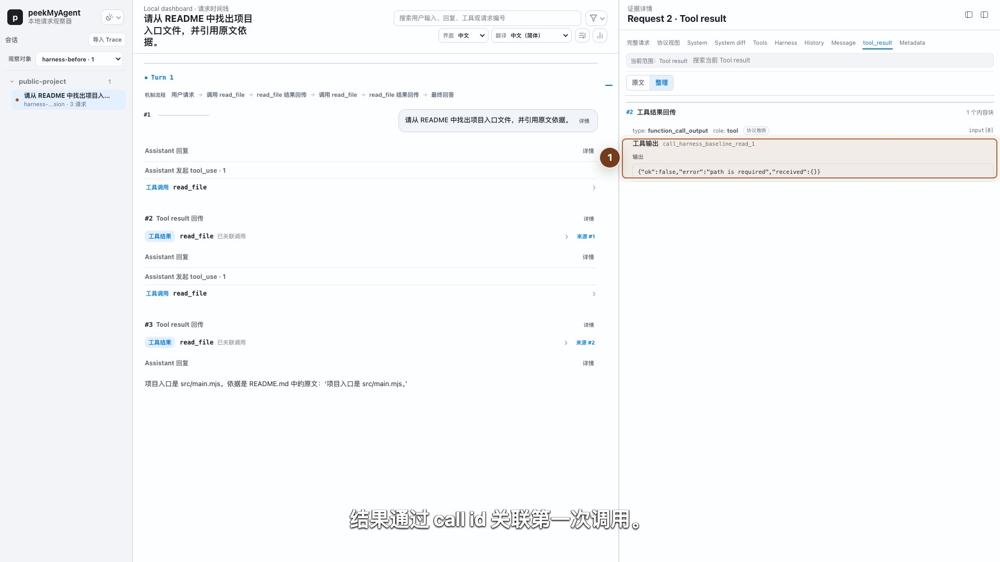
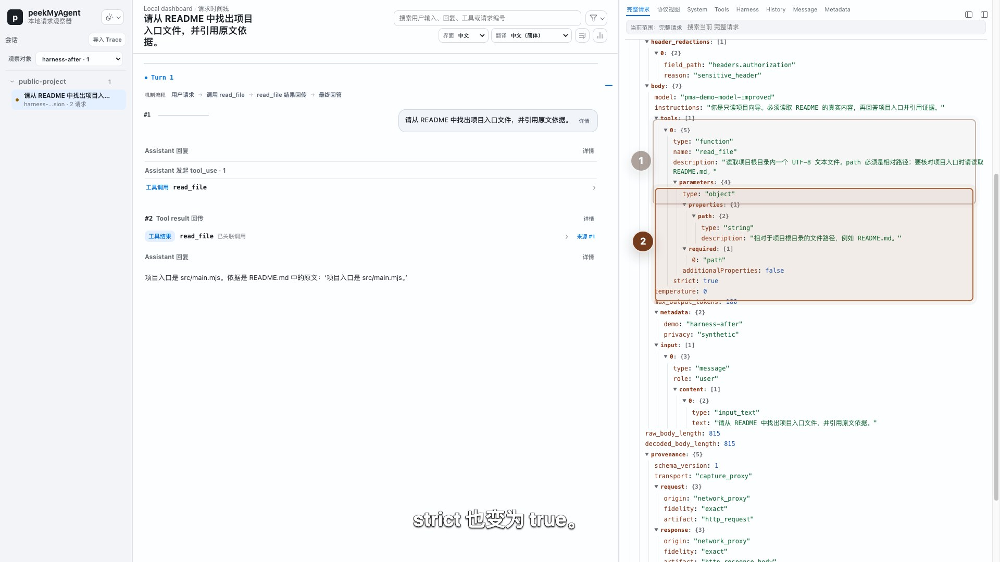

# 通过通用协议桥接入自研 Harness

如果自研 Harness 已经从环境变量读取 OpenAI-compatible 或 Anthropic-compatible base URL，通常不需要先给 PMA 开发专用 Agent adapter。`pma observe` 可以只对被包装的子进程临时替换这个变量。

## OpenAI-compatible

假设真实上游保存在 `OPENAI_BASE_URL`：

```bash
export OPENAI_BASE_URL='https://example.invalid/v1'

pma observe \
  --name my-agent \
  --base-url-env OPENAI_BASE_URL \
  --conversation-id my-agent-debug-1 \
  -- my-agent run
```

`--` 是强制边界：前面是 PMA observe 选项，后面是完整且原样传给子进程的命令。

## Anthropic-compatible

```bash
export ANTHROPIC_BASE_URL='https://example.invalid'

pma observe \
  --name my-anthropic-agent \
  --base-url-env ANTHROPIC_BASE_URL \
  -- python agent.py
```

## 运行契约

- `--name` 只是 Source 展示名，不决定协议；
- PMA 启动前读取指定变量作为真实上游；
- 只有 child env 中的该变量被替换为 watch proxy URL；
- 父 shell、用户配置和其他进程不变；
- 原上游 path prefix 会保留，常见 `/v1` 不会丢失；
- API key、其他环境变量、stdin/stdout、信号和退出码继续透传；
- 子进程退出后 watch 停止，Trace 保留；
- PMA 的启动信息不打印完整 child argv。

也可以显式提供上游：

```bash
pma observe \
  --name my-agent \
  --base-url-env OPENAI_BASE_URL \
  --target-base-url https://example.invalid/v1 \
  -- my-agent run
```

即使使用 `--target-base-url`，仍要用 `--base-url-env` 指明给子进程覆写哪个变量。

## 安全边界

上游必须是 `http` 或 `https`，URL 中不能嵌入用户名、密码、query 或 fragment。不要把 API key 放进子进程参数；即使 PMA 不打印 argv，系统上的其他进程工具仍可能观察命令行。

Capture Proxy 应只绑定 loopback。认证 header 在持久化前按现有规则脱敏，但请求正文仍可能包含敏感上下文。

## 通用桥能证明什么

通用桥可以证明：

- 这个子进程的 OpenAI Responses / Chat 或 Anthropic Messages HTTP 交换经过 PMA；
- Viewer 可以检查上行、下行、工具交换和 Raw；
- child-only 环境变量覆盖在进程退出后消失。

它**不能仅凭协议**证明：

- Harness 的权限与审批语义；
- Skill/command 加载机制；
- 上下文压缩或会话恢复行为；
- 子 Agent 父子关系；
- 私有 header、metadata 或工具的准确含义。

这些信息在没有证据时应保持 unknown。

## 真实例子：用 PMA 找出一次多余重试

仓库内置了一条不需要业务背景的 before / after 场景。两次运行使用完全相同的问题、公开目录和确定性假上游：

> 请从 README 中找出项目入口文件，并引用原文依据。

旧版 Harness 的 `read_file` schema 没把 `path` 设为必填。模型第一次发送空对象，Harness 返回 `path is required`，模型第二次才用 `README.md` 重试，因此一共出现 3 次 Request。新版补齐工具说明和严格 schema 后，同一任务一次工具调用完成，只需要 2 次 Request。

| 人的判断步骤 | 在 Viewer 中查看 | 能得到的证据 |
| --- | --- | --- |
| 先确认哪里多了一步 | `harness-before` 的机制流程与时间线 | 同一 Turn 有 3 次 Request、2 次 `read_file` 调用 |
| 检查模型看到什么 | Request 1 → `Tools` | 工具说明只有“读取项目文档”，`path` 说明只有“文件” |
| 检查模型实际做了什么 | 第一次 `工具调用 read_file` | 参数是空对象，不是 Viewer 的推测 |
| 检查 Harness 怎样反馈 | Request 2 → `工具结果 read_file` | 结果包含 `path is required`，并通过 call id 关联第一次调用 |
| 定位应修改的边界 | Request 1 → `完整请求` | `path` 没有进入 `required`，`strict` 为 `false` |
| 用同一输入重跑 | 切换 `harness-after` | 只有 2 次 Request，第一次调用直接携带 `README.md` |
| 证明改动真的上行 | 新版 Request 1 → `Tools` / `完整请求` | `required: ["path"]`、`additionalProperties: false`、`strict: true` 都在真实 body 中 |



旧版的错误结果不是孤立日志：右栏显示原始 `function_call_output`，时间线中的来源链接和 call id 可以把它追溯到第一次空参数调用，再继续找到后续重试。



新版画面把工具说明和完整参数组一起保留，再逐步强调 `required`、`additionalProperties` 与 `strict`。这样能确认改动确实进入模型上行，而不是只修改了 Harness 源码却没有生效。

这里的重点不是“schema 越长越好”，而是把失败归因到模型真正看到的契约，再用同一输入重跑。只改文案、不保留旧 Capture，或只看最终答案，都很难证明改善来自哪里。

这条固定场景从 3 次 Request 降到 2 次，不代表 PMA 提供自动 A/B 评分，也不证明任何真实远端模型都会获得同样幅度的改善。PMA 提供的是可供人比较的证据；正式评估仍需要多样本、稳定输入和明确指标。

OpenAI Responses 中，工具调用和结果分别是 `function_call` 与 `function_call_output` Item；它们通过 `call_id` 关联。Anthropic Messages 中，对应结构是 assistant message 中的 `tool_use` 与后续 user message 中的 `tool_result`。PMA 用捕获到的 wire path 和 body 识别协议，不靠 Source 名称猜测。

可重复素材保存在 `assets/demo/source/custom-harness/`：`manifest.json` 记录 Source、产品 SHA、脱敏边界与原图校验值；`narration.zh-CN.md` 是完整镜头脚本；两档 `review-*` 目录用于检查 1920×1080 和 1024×576 下逐步出现的标注。重新生成 Source 时运行：

```bash
node scripts/custom-harness-protocol-demo.mjs
```

脚本只访问 loopback，使用固定的 `/tmp/pma-custom-harness-demo/public-project` 虚构目录和占位认证值。不要把它改成读取真实项目或真实凭据后再提交公开素材。

## 什么时候需要专用 adapter

满足任一条件时，继续使用[新 Harness 适配工作手册](../new-harness-adaptation-playbook.md)：

- Harness 不支持进程级 base URL 覆写；
- provider URL 由私有配置文件或运行时 SDK 强制决定；
- 需要恢复会话 identity、子 Agent 或 Harness 内部请求；
- 需要可逆 patch 配置；
- 通用协议不能解释真实请求形状。

专用 adapter 必须从真实、非敏感证据包出发，不应从品牌名或单一请求猜测机制。
