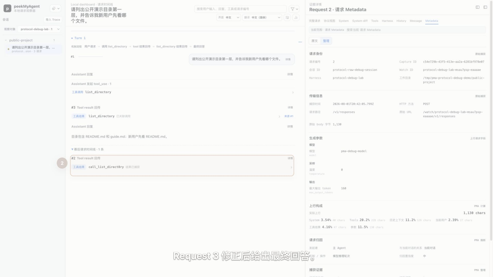
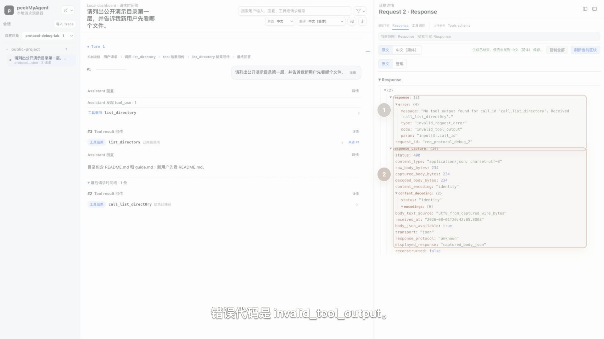

# 查看原始协议与调试异常

摘要视图适合快速理解，协议视图和 Raw Inspector 用于回答“原始字段究竟是什么”。当 adapter 分类、工具关联、上下文变化或模型参数看起来异常时，最终应回到这两层证据。


## 协议视图与 Raw 的区别

| 视图 | 适合解决什么问题 |
| --- | --- |
| 协议视图 | 按厂商原生语义顺序阅读 instructions/messages、tool call/result 和 response output |
| Raw Inspector | 检查 Capture headers、body、response、provenance、脱敏记录和任何未被摘要投影的字段 |

协议视图不是二次生成的对话稿。每个条目保留原始位置，例如 `$.input[4]`、`$.messages[2].content[1]`，并可以继续跳到 Raw。

## 当前可识别协议

Viewer 当前能解析并展示以下协议证据：

- OpenAI Responses；
- OpenAI Chat Completions；
- Anthropic Messages；
- Google GenerateContent。

“Viewer 能解析”不等于每个 Harness adapter 都能精确捕获所有协议，也不等于兼容服务完全遵循官方语义。实际能力取决于这条 Source 的 Capture transport、adapter 和响应完整度。

## 真实例子：从错误 call id 追到 HTTP 400

下面的最小场景没有业务背景：用户只让 Agent 列出公开演示目录的第一层。确定性 OpenAI Responses 假上游与真实 Capture Proxy 共同生成 1 个 Turn、3 次 Request：

| Request | 原始交换 | Viewer 中要核对什么 |
| --- | --- | --- |
| 1 | 模型返回 `list_directory` 的 `function_call`，`call_id` 是 `call_list_directory` | 工具名称、参数和调用 ID |
| 2 | Harness 回传 `function_call_output`，却把 ID 写成 `call_list_direct0ry` | 幕后请求时间线、协议未知项、Raw 字段路径、Response 原文和 HTTP 400 |
| 3 | Harness 恢复正确 ID，并移除用于测试的未知兼容项 | 相同 Raw 搜索不再命中错误拼写，协议下行是 `completed`，最终 Assistant 消息存在 |

先展开主时间线底部的“幕后请求时间线”，再点 Request 2 的 `详情`。失败请求不会因为 Request 3 已经成功而消失，但它不会自动占据主阅读顺序；这一步能避免只看到最终答案就错过中间异常。



切到 `协议视图` 后，Viewer 按 OpenAI Responses 原生顺序展示四个上行项，并把测试用 `compatibility_note` 标成 `Schema 未识别`。这个提示只说明投影器不认识该项，**不能**据此断言它导致失败。打开 `完整请求`，在 Raw 中搜索 `call_list_`，才能同时看到 `$.input[1].call_id` 的正确值和 `$.input[3].call_id` 的错误值。

接着从协议页打开 `完整下行`，把 Response 切到 `原文`。上游错误对象明确给出 `invalid_tool_output`、参数位置 `input[3].call_id`，下方 capture 元数据记录 HTTP 400；这是错误原因的直接证据。



最后查看 `完整请求` 底部的 provenance：本例中 request 与 response 的 `fidelity` 都是 `exact`，关联置信度也来自同一 Capture 生命周期。它证明原始交换被完整保存，但不代表客户端请求在语义上正确。切到 Request 3，用同一个 Raw 查询和协议视图复查，才能完成“发现异常 → 核对原因 → 验证修正”的闭环。

这套公开素材由 `scripts/protocol-raw-debug-demo.mjs` 生成，只访问 loopback，使用固定 `/tmp/pma-protocol-debug-demo/public-project` 和占位认证值。完整镜头脚本、脱敏边界、原图校验值与双尺寸审阅结果见 `assets/demo/source/protocol-raw/manifest.json`。

## OpenAI Responses 示例

经过脱敏的上行可以类似：

```json
{
  "model": "gpt-5.6",
  "instructions": "Use only public demo files.",
  "input": [
    { "type": "message", "role": "user", "content": [{ "type": "input_text", "text": "读取 README" }] },
    { "type": "function_call", "call_id": "call_read", "name": "read_file", "arguments": "{\"path\":\"README.md\"}" },
    { "type": "function_call_output", "call_id": "call_read", "output": "# hello-agent" }
  ],
  "tools": [{ "type": "function", "name": "read_file" }],
  "reasoning": { "effort": "medium", "summary": "auto" },
  "stream": true
}
```

重点核对 `input` 顺序、call id、工具定义是否真的存在，以及 response 的完整终态事件是否被捕获。

## Anthropic Messages 示例

```json
{
  "model": "claude-sonnet-4-20250514",
  "system": [{ "type": "text", "text": "Use only public demo files." }],
  "messages": [
    { "role": "user", "content": "读取 README" },
    { "role": "assistant", "content": [{ "type": "tool_use", "id": "read_1", "name": "Read", "input": { "file_path": "README.md" } }] },
    { "role": "user", "content": [{ "type": "tool_result", "tool_use_id": "read_1", "content": "# hello-agent" }] }
  ],
  "tools": [{ "name": "Read", "input_schema": { "type": "object" } }]
}
```

Anthropic 的 tool result 通常位于后续 `user` message 的 content 中。不要因为摘要把它标为“工具结果”就误以为原始 role 是 `tool`。

## Raw Inspector 搜索

Raw 搜索适合定位：

- call id、tool use id 或 request id；
- 某个模型参数；
- System 中的特定短语；
- header 是否存在以及是否被脱敏；
- response error、finish reason 或 usage；
- 兼容层新增的未知字段。

搜索结果应在当前 Raw 区块内高亮和导航。切换 Source 或 Request 后要重新确认当前范围，避免把上一条 Source 的命中当作当前证据。

## 常见异常排查顺序

1. 时间线摘要是否缺失，还是 Capture 本身没有字段；
2. 协议视图是否能定位到原始 source path；
3. Raw body 是否完整、是否截断或按需加载；
4. response 是否有终态事件或完整 body；
5. provenance 是否说明 exact proxy、OTel、rollout 或导入证据；
6. adapter 的推断是否与 Raw 冲突。

Raw 与摘要冲突时以 Raw 和 provenance 为事实源，并把差异记录为产品反馈。

## 隐私提醒

Raw 可能包含完整 System、历史消息、工具 schema、路径、源码片段和模型回复。认证 header 会按规则脱敏，但这不代表整份 Raw 可以直接公开。分享前必须逐字段审查。
