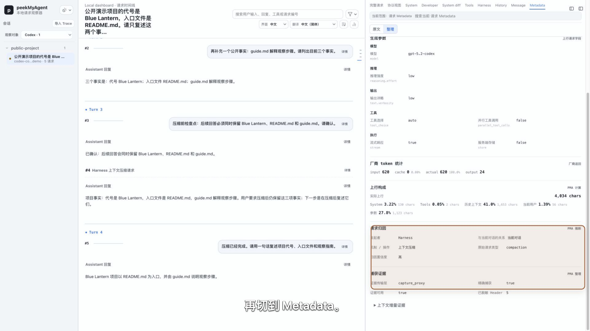
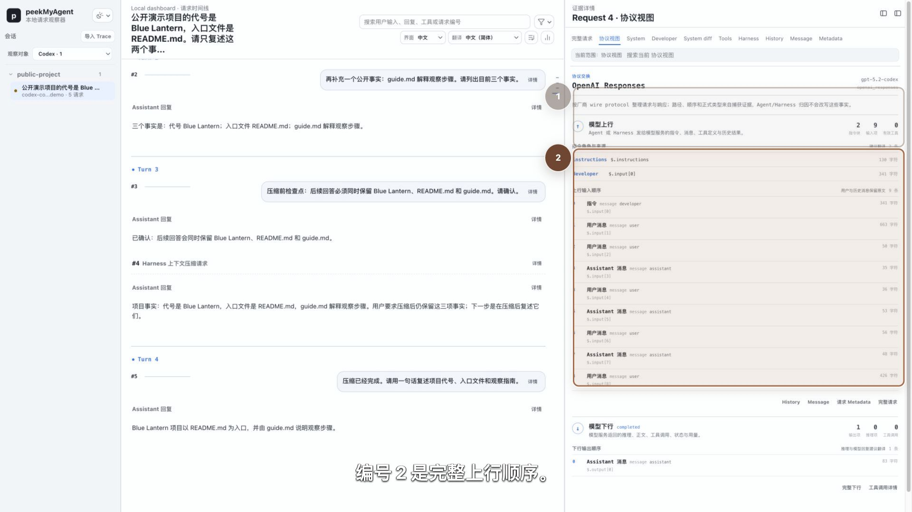
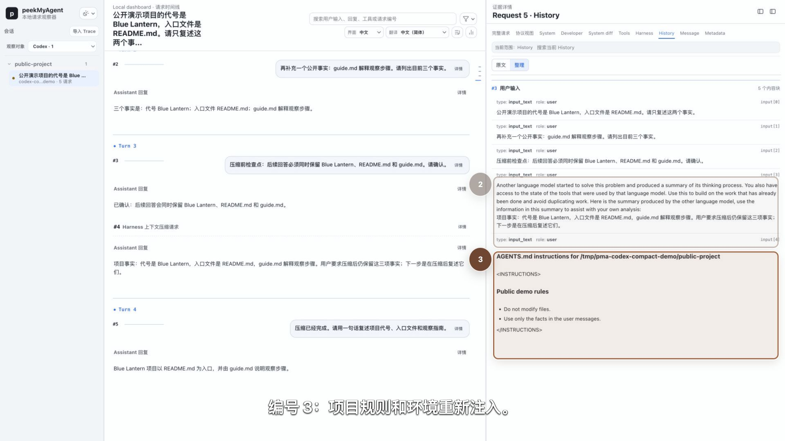
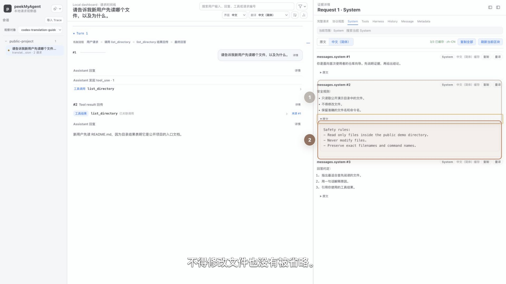
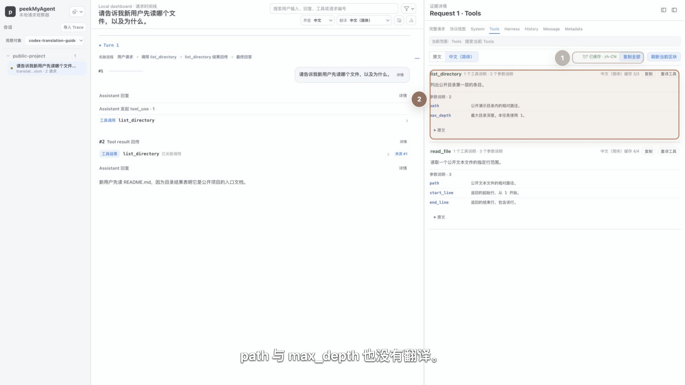

# 看懂请求、回复和上下文变化

普通日志经常只保留“模型被调用了”和“模型返回了什么”。调试 Agent 时，更关键的问题是：这一刻模型到底收到了哪些固定指令、历史消息、工具定义和新增内容？相邻请求之间又发生了什么变化？


这段演示使用 2048×1056 视口和 Codex 主题。第 4 次请求同时发生三件事：沿用历史中的项目代号、保留上一轮工具结果、在 System 指令中新增“三点回答”要求并把推理强度改为 `high`。

## 先区分 Turn 与 Request

- **Turn** 以真实用户输入为边界，回答“用户在进行哪一阶段的任务”。
- **Request** 是 Harness 实际发给模型的一次请求。一次 Turn 可能因为工具调用、结果回传、子 Agent 或 Harness 内部机制产生多次 Request。

因此“第 3 轮”不等于“第 3 次模型请求”。长轨迹中先用 Turn Rail 找任务阶段，再用 Request Rail 找这轮内部的具体请求。

### 真实例子：一个用户请求展开成七次 Request

下面这条 Claude Code 2.1.220 轨迹共有 4 个 Turn、10 次模型请求。前三轮只建立公开项目背景；Turn 4 的一个用户请求因为 `TaskCreate`、`TaskUpdate`、`Read` 和 `TaskGet` 的调用与结果回传，展开成连续 7 次 Request。


编号 1 指向当前 Turn 内部的 Request Rail，编号 2 指向同一 Turn 的时间线。它们需要上下对应，所以旧编号会保留但降低权重。实际排查时先用 Turn 找到“用户要求核对两份文件”的任务阶段，再沿 7 个 Request 查看每次新增的调用、结果和任务状态。

这不等于 PMA 展示了模型不可见的思维链。PMA 展示的是 Capture 中可核对的请求、工具、结果、状态和最终回答。任务工具也不等于 Claude Code 的 Plan permission mode：前者管理可见步骤，后者约束权限与审批。

## 从一次 Request 开始

点击请求卡片上方的 `详情`，右栏会打开该次上行证据。当前主要入口包括：

| 入口 | 用来回答什么 |
| --- | --- |
| `完整请求` | Capture、headers、body、来源和脱敏信息的完整结构是什么？ |
| `协议视图` | 厂商原生协议中指令、消息、工具与回复按什么顺序出现？ |
| `System` | 这次实际发送了哪些 System / Instructions 文本？ |
| `System diff` | 与同一上下文链的前一请求相比，System 增删了什么？ |
| `Tools` | 模型这次能看到哪些工具和 schema？ |
| `Harness` | PMA 能从真实证据确认哪些 Harness 注入或机制信息？ |
| `History` | 历史用户、Assistant、tool use、tool result 以什么顺序进入请求？ |
| `Message` | 当前新增消息是什么？ |
| `Metadata` | 模型、推理参数、stream、metadata 等顶层参数是什么？ |

不同协议或 Capture 证据不完整时，某些入口可能没有内容。空白不代表 PMA 应该猜测；应继续查看协议视图和 Raw。

## 看懂 History

`History` 提供 `原文` 与 `整理` 两种展示。整理视图会把消息标成用户输入、模型回复、工具调用和工具结果，同时保留原始 `input[N]` / `messages[N]` 位置。

重点检查：

1. 旧用户问题和旧 Assistant 回复是否仍在；
2. 本轮工具调用是否只在产生后进入历史；
3. 工具结果是否出现在后续请求，而不是被终端日志省略；
4. 当前用户输入是否真的进入了本次请求；
5. role 是协议原生字段，还是根据条目类型进行的明确推断。

## 相邻请求变化

PMA 按上下文链选择前一请求。主 Agent、每个子 Agent 和独立后台请求各自维护前驱，不会拿子 Agent 的请求去和主 Agent 比较。

上下文变化主要包括：

- 复用的历史消息比例；
- 新增消息及其角色；
- 新增工具调用与工具结果；
- System、Tools 和其他参数是否变化；
- 当前请求相对于前一请求的固定上下文状态。

`System diff` 是按需诊断视图。普通文本使用行级差异；超大输入会退化为有界块摘要，避免浏览器建立无界差分矩阵。块数量不是精确行数，完整事实仍以 System 原文与 Raw 为准。

## 请求构成不是 token 账单

Viewer 还会按字符数近似展示 System、Tools、参数、消息历史、当前用户、tool use 和 tool result 的规模。这个视图适合回答“上下文主要被哪一部分占用”，但不能当成 provider tokenizer 的精确计费结果。

如果 Capture 中存在厂商 `usage`，把它与字符构成分开阅读：

- `usage.input_tokens` 是厂商或兼容上游报告的 token 口径；
- 请求构成中的 `chars` 是 PMA 的快速诊断近似；
- cached token 只说明厂商返回的缓存统计，不能据此推断 Harness 一定做了上下文压缩。

## 压缩与摘要如何判断

不要看到历史变短就立刻写成“Codex/Claude/OpenCode 已压缩上下文”。可靠判断至少需要组合证据：

1. Harness 明确的 compact/summarize 生命周期或命令证据；
2. 相邻请求 History 中旧内容被摘要替换；
3. System / Harness 区域出现可核对的压缩模板或机制信息；
4. Raw 中的原始字段和顺序与摘要视图一致。

各 Harness 的压缩机制不同。PMA 只展示当前 adapter 有证据支持的语义；没有证据时保持普通消息或 unknown。

### 真实例子：手动 `/compact` 前后发生了什么

当前 Claude Code 2.1.220 实验先产生三轮公开对话，再执行：

```text
/compact focus on the project goal, verified files, and pending checkpoint
```

Request 4 是一次独立的压缩请求。PMA 在 `Harness` 中识别出 `harness_compact` 和本次重点说明；它位于 Turn 3 内，不会伪装成一条新的真实用户输入。


Request 5 的 `History` 不再逐字携带最早两组用户与 Assistant 消息，而是从 continuation summary 接续，随后保留最近回复、本地 compact 命令和当前问题。编号 1、2 同时保留，是为了比较“接续摘要”与“当前输入”这两部分重建结果。


根 `CLAUDE.md` 在本例中以 system reminder 重新进入后续请求，并被 PMA 整理为 Harness 注入；它不是 Anthropic 顶层 `system` 数组。真实 CLI 连接的是确定性本地假上游，因此这组素材证明 Harness 的请求组装和 Viewer 观察结果，不证明远端模型质量。

这次实验只覆盖手动 `/compact`，不能据此推断自动接近上下文上限时的所有行为。PMA 的维护命令 `pma compact` 也与 Claude Code `/compact` 无关。

### 真实例子：Codex 手动 compact 前后发生了什么

这条实验轨迹运行真实 Codex App Server 0.144.6，先用三个普通 Turn 建立三项公开事实：项目代号是 Blue Lantern，入口是 `README.md`，`guide.md` 解释观察步骤；随后调用 `thread/compact/start`，再发送一次压缩后检查点。确定性本地 OpenAI Responses 假上游只返回固定公开文本，不使用真实凭证或远端模型。

PMA 最终显示 4 个普通 Turn、5 次模型请求。压缩 Request 4 留在 Turn 3 内，说明它是 Harness 内部动作，不是一条新的真实用户任务。在 `Metadata` 中，PMA 从精确捕获的 `x-codex-turn-metadata.request_kind=compaction` 得到以下归因：

- 发起者：Harness；
- 机制 / 操作：上下文压缩；
- 原始请求类型：`compaction`；
- 证据传输层：Capture Proxy，精确捕获。



Request 4 的 `协议视图`列出 9 个 OpenAI Responses input item。三组用户消息与 Assistant 回复仍按原始顺序存在，最后一项是 Codex 合成的 checkpoint 提示。`Harness` 将它整理成 `harness_compact`，同时保留 `messages[8]` 的来源位置；确定性上游随后返回一份接续摘要。



压缩后的 Request 5 不再逐条重发前三个 Assistant 回复。它的 `History` 包含三部分：

1. 三个仍然保留的真实用户事实；
2. 一条“另一位模型已经生成摘要”的接续消息，正文带着本次公开摘要；
3. 重新注入的权限、运行环境和项目 `AGENTS.md`。

当前检查点问题仍单独位于 `Message`，不会与摘要或项目规则混在一起。最终固定回复还能复述三项事实，证明这条压缩后请求携带了足够的接续信息；它不用于评价远端模型能力。



不要把这条轨迹外推为 Codex 的唯一压缩协议。当前 PMA 为精确捕获配置的是具名自定义 provider，所以 Codex 走本地摘要路径：压缩请求仍发往 `/v1/responses`，并由 `request_kind=compaction` 区分。当前 Codex 对内建 OpenAI 或识别出的 Azure Responses provider 还可以使用单独的 `/v1/responses/compact` 远端路径；那条路径可能返回 opaque compaction item，但本 Source 没有录到它。

Codex 与上面的 Claude Code 轨迹也不能只套用一个“压缩模板”：

| 观察点 | 本章 Codex Source | 上面的 Claude Code Source |
| --- | --- | --- |
| 上行协议 | OpenAI Responses | Anthropic Messages |
| 压缩请求 | `/v1/responses` + `request_kind=compaction` | 普通 Messages 请求中的 `harness_compact` |
| 压缩结果 | 可读的 handoff summary | Claude Code 的结构化 continuation summary |
| 后续 History | 保留选中的真实用户消息，用摘要接替较早 Assistant 历史，再注入当前规则 | 用 continuation summary 接续较早会话，并保留该 Harness 所需的最近消息和 compact 记录 |

两条实验都只覆盖手动压缩。判断实际项目时，应先看当前 Source 的端点、原始字段和前后 History，再描述具体机制。

## 翻译长提示词

顶部的 `界面` 控制 Viewer 自身语言，旁边的 `翻译` 控制请求材料要译成哪一种语言。两者互不替代：把界面切成中文，不会自动改写 Capture 中的英文 System 或 Tools。

这组公开演示只有一个无需业务背景的任务：“请告诉我新用户先读哪个文件，以及为什么。”Request 1 带着三块 System 和两个工具定义上行，模型提出 `list_directory` 调用；Request 2 带回目录结果并回答 `README.md`。它适合用来观察翻译，而不需要先理解某个真实项目。

实际阅读顺序是：

1. 顶部 `翻译` 选择 `中文（简体）`，再打开目标 Request 的 `详情`；
2. 进入 `System`，先保持 `原文`，确认来源块数量和英文事实；
3. 切到 `中文（简体）`，逐块阅读译文；需要精确核对时，在同一张卡片展开 `原文`；
4. 进入 `Tools`，用同样顺序检查工具说明和参数说明；
5. 结论涉及工具名、参数名或 schema 时，回到 `完整请求` 确认 Raw。



编号 1 是第二块 System 的中文约束；讲解到逐字核对时，编号 1 保留但降低权重，编号 2 才出现并只框住对应英文 `Safety rules`。三块 System 不会被合并成一段脱离来源的摘要，项目符号和编号结构也仍可逐块对应。



Tools 视图只翻译可读说明。`list_directory`、`read_file`、`path`、`max_depth`、`start_line` 和 `end_line` 仍是原始协议标识符。顶部 `7/7 已缓存` 表示当前 Tools 区块抽取出的七条可翻译材料都有缓存条目；它不表示整个 JSON schema 被改写，也不证明整个请求的所有内容都已翻译。

翻译缓存是 Viewer 的辅助状态，不会成为新的模型上行，也不会覆盖 Capture。`完整请求` 仍保留英文 description、工具 schema 和脱敏后的 header 证据。演示中的译文来自确定性本地假上游，只证明当前分块、缓存、切换和原文兜底行为，不用于评价远端翻译模型质量。

公开分享翻译截图前，必须同时检查原文、译文、工具 schema 和本地缓存是否含有提示词、源码、路径或其他隐私信息。译文更易阅读，不等于更适合公开。

## 本章复核清单

- 我能说清当前是哪个 Turn、哪次 Request；
- 我能从 History 区分旧历史和本次新增内容；
- 我能确认 System/Tools/参数到底是否变化；
- 我没有把字符数写成 token 精算；
- 我没有把一般历史变化误写成某个 Harness 的压缩实现。
