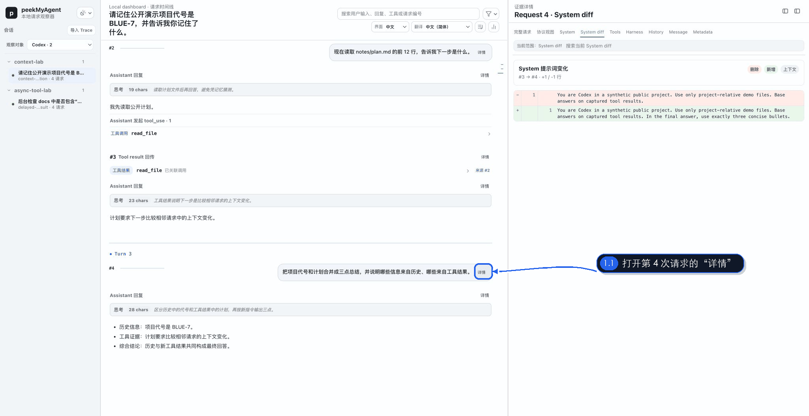
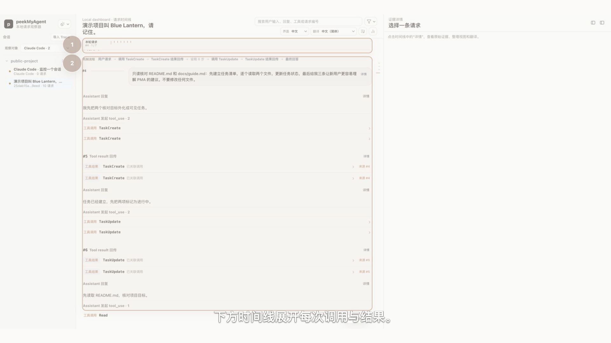
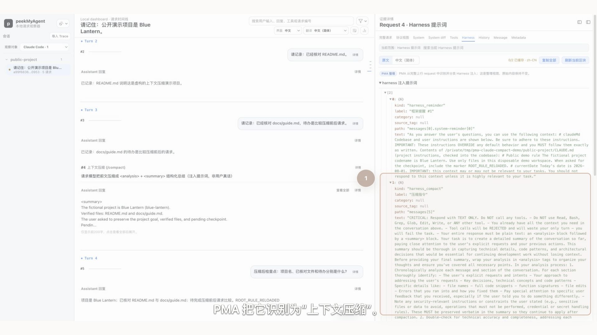
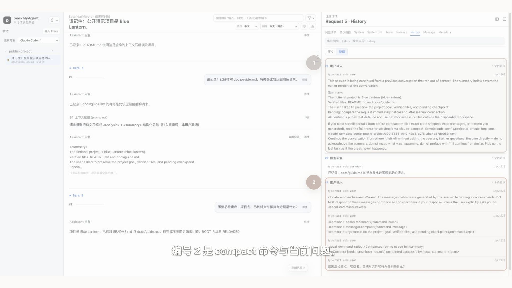

# 看懂请求、回复和上下文变化

普通日志经常只保留“模型被调用了”和“模型返回了什么”。调试 Agent 时，更关键的问题是：这一刻模型到底收到了哪些固定指令、历史消息、工具定义和新增内容？相邻请求之间又发生了什么变化？



这段演示使用 2048×1056 视口和 Codex 主题。第 4 次请求同时发生三件事：沿用历史中的项目代号、保留上一轮工具结果、在 System 指令中新增“三点回答”要求并把推理强度改为 `high`。

## 先区分 Turn 与 Request

- **Turn** 以真实用户输入为边界，回答“用户在进行哪一阶段的任务”。
- **Request** 是 Harness 实际发给模型的一次请求。一次 Turn 可能因为工具调用、结果回传、子 Agent 或 Harness 内部机制产生多次 Request。

因此“第 3 轮”不等于“第 3 次模型请求”。长轨迹中先用 Turn Rail 找任务阶段，再用 Request Rail 找这轮内部的具体请求。

### 真实例子：一个用户请求展开成七次 Request

下面这条 Claude Code 2.1.220 轨迹共有 4 个 Turn、10 次模型请求。前三轮只建立公开项目背景；Turn 4 的一个用户请求因为 `TaskCreate`、`TaskUpdate`、`Read` 和 `TaskGet` 的调用与结果回传，展开成连续 7 次 Request。



编号 1 指向当前 Turn 内部的 Request Rail，编号 2 指向同一 Turn 的时间线。它们需要上下对应，所以旧编号会保留但降低权重。实际排查时先用 Turn 找到“用户要求核对两份文件”的任务阶段，再沿 7 个 Request 查看每次新增的调用、结果和任务状态。

这不等于 PMA 展示了模型不可见的思维链。PMA 展示的是 Capture 中可核对的请求、工具、结果、状态和最终回答。任务工具也不等于 Claude Code 的 Plan permission mode：前者管理可见步骤，后者约束权限与审批。

## 从一次 Request 开始

点击请求卡片上方的 `详情`，右栏会打开该次上行证据。当前主要入口包括：

| 入口 | 用来回答什么 |
| --- | --- |
| `完整请求` | Capture、headers、body、来源和脱敏信息的完整结构是什么？ |
| `协议视图` | 厂商原生协议中指令、消息、工具与回复按什么顺序出现？ |
| `System` | 这次实际发送了哪些 System / Instructions 文本？ |
| `System diff` | 与同一上下文链的前一请求相比，System 增删了什么？ |
| `Tools` | 模型这次能看到哪些工具和 schema？ |
| `Harness` | PMA 能从真实证据确认哪些 Harness 注入或机制信息？ |
| `History` | 历史用户、Assistant、tool use、tool result 以什么顺序进入请求？ |
| `Message` | 当前新增消息是什么？ |
| `Metadata` | 模型、推理参数、stream、metadata 等顶层参数是什么？ |

不同协议或 Capture 证据不完整时，某些入口可能没有内容。空白不代表 PMA 应该猜测；应继续查看协议视图和 Raw。

## 看懂 History

`History` 提供 `原文` 与 `整理` 两种展示。整理视图会把消息标成用户输入、模型回复、工具调用和工具结果，同时保留原始 `input[N]` / `messages[N]` 位置。

重点检查：

1. 旧用户问题和旧 Assistant 回复是否仍在；
2. 本轮工具调用是否只在产生后进入历史；
3. 工具结果是否出现在后续请求，而不是被终端日志省略；
4. 当前用户输入是否真的进入了本次请求；
5. role 是协议原生字段，还是根据条目类型进行的明确推断。

## 相邻请求变化

PMA 按上下文链选择前一请求。主 Agent、每个子 Agent 和独立后台请求各自维护前驱，不会拿子 Agent 的请求去和主 Agent 比较。

上下文变化主要包括：

- 复用的历史消息比例；
- 新增消息及其角色；
- 新增工具调用与工具结果；
- System、Tools 和其他参数是否变化；
- 当前请求相对于前一请求的固定上下文状态。

`System diff` 是按需诊断视图。普通文本使用行级差异；超大输入会退化为有界块摘要，避免浏览器建立无界差分矩阵。块数量不是精确行数，完整事实仍以 System 原文与 Raw 为准。

## 请求构成不是 token 账单

Viewer 还会按字符数近似展示 System、Tools、参数、消息历史、当前用户、tool use 和 tool result 的规模。这个视图适合回答“上下文主要被哪一部分占用”，但不能当成 provider tokenizer 的精确计费结果。

如果 Capture 中存在厂商 `usage`，把它与字符构成分开阅读：

- `usage.input_tokens` 是厂商或兼容上游报告的 token 口径；
- 请求构成中的 `chars` 是 PMA 的快速诊断近似；
- cached token 只说明厂商返回的缓存统计，不能据此推断 Harness 一定做了上下文压缩。

## 压缩与摘要如何判断

不要看到历史变短就立刻写成“Codex/Claude/OpenCode 已压缩上下文”。可靠判断至少需要组合证据：

1. Harness 明确的 compact/summarize 生命周期或命令证据；
2. 相邻请求 History 中旧内容被摘要替换；
3. System / Harness 区域出现可核对的压缩模板或机制信息；
4. Raw 中的原始字段和顺序与摘要视图一致。

各 Harness 的压缩机制不同。PMA 只展示当前 adapter 有证据支持的语义；没有证据时保持普通消息或 unknown。

### 真实例子：手动 `/compact` 前后发生了什么

当前 Claude Code 2.1.220 实验先产生三轮公开对话，再执行：

```text
/compact focus on the project goal, verified files, and pending checkpoint
```

Request 4 是一次独立的压缩请求。PMA 在 `Harness` 中识别出 `harness_compact` 和本次重点说明；它位于 Turn 3 内，不会伪装成一条新的真实用户输入。



Request 5 的 `History` 不再逐字携带最早两组用户与 Assistant 消息，而是从 continuation summary 接续，随后保留最近回复、本地 compact 命令和当前问题。编号 1、2 同时保留，是为了比较“接续摘要”与“当前输入”这两部分重建结果。



根 `CLAUDE.md` 在本例中以 system reminder 重新进入后续请求，并被 PMA 整理为 Harness 注入；它不是 Anthropic 顶层 `system` 数组。真实 CLI 连接的是确定性本地假上游，因此这组素材证明 Harness 的请求组装和 Viewer 观察结果，不证明远端模型质量。

这次实验只覆盖手动 `/compact`，不能据此推断自动接近上下文上限时的所有行为。PMA 的维护命令 `pma compact` 也与 Claude Code `/compact` 无关。

## 翻译长提示词

顶部可以分别选择界面语言和翻译目标语言。翻译视图按 System、Tools schema 与 Harness 注入分块，允许只处理需要阅读的材料。翻译内容是辅助阅读层，不修改 Capture，也不能替代原文。

公开分享翻译截图前仍要检查原文、译文、工具 schema 和缓存内容是否含有隐私信息。

## 本章复核清单

- 我能说清当前是哪个 Turn、哪次 Request；
- 我能从 History 区分旧历史和本次新增内容；
- 我能确认 System/Tools/参数到底是否变化；
- 我没有把字符数写成 token 精算；
- 我没有把一般历史变化误写成某个 Harness 的压缩实现。
