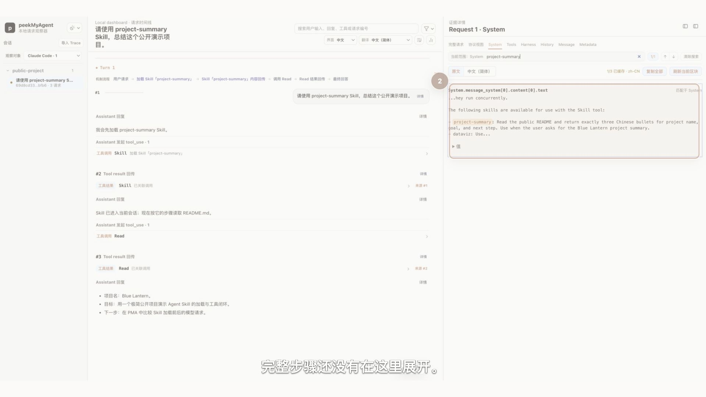
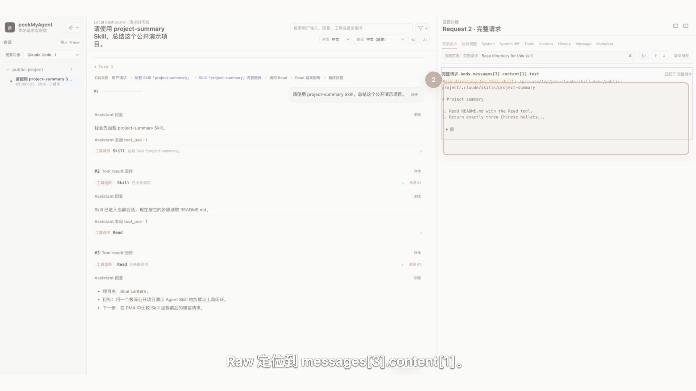
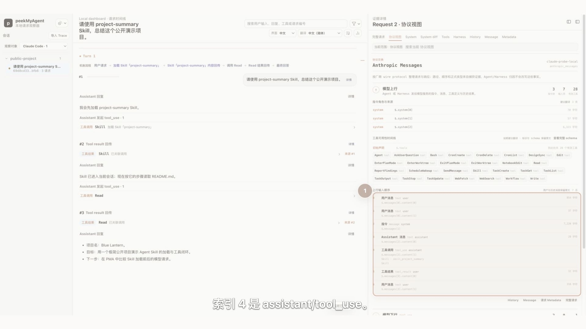

# 看懂 Skill 的发现、加载与后续工具调用

Skill 和工具解决的不是同一个问题。工具提供可执行能力，例如读取文件或运行命令；Skill 提供一组按需加载的工作方法，告诉 Agent 在某类任务中应该怎样使用这些能力。PMA 可以把“可发现信息、加载动作、完整正文、后续工具调用”放回同一条请求链中核对。

本章使用 Claude Code 2.1.220 的真实 CLI，通过 PMA Capture Proxy 连接确定性本地 Anthropic Messages 假上游。项目、Skill、模型回复和文件内容都是公开虚构数据；这组证据验证的是 Claude Code 的请求组装与 PMA 的观察能力，不代表真实远端模型质量，也不保证后续版本永远保持相同的 wire shape。

## 先建立四层模型

一次 Skill 使用可以分成四层：

1. **发现**：模型先看到 Skill 名称和简短 description，知道什么时候可以使用它；
2. **选择**：模型或用户触发通用 `Skill` 工具，并传入具体 Skill 名称；
3. **加载**：Harness 把加载回执与完整 Skill 正文放进后续模型请求；
4. **执行**：正文指导模型继续调用 `Read`、`Bash` 或其他普通工具，真正访问本地资源。

Skill 正文本身不会读取文件。它提供流程知识，真正的本地动作仍由 Harness 执行工具。

## 第一次请求：先看到 description

在 Request 1 打开 `详情`，进入 `System`，搜索 `project-summary`。当前真实轨迹中，System 的可用 Skill 清单包含名称和一行 description，但完整步骤尚未进入这里。



再进入 `Tools`。这次请求声明了一个通用 `Skill` 工具和 `Read` 等普通工具，没有为 `project-summary` 额外生成一个同名专用工具。模型随后返回：

```json
{
  "name": "Skill",
  "input": {
    "skill": "project-summary"
  }
}
```

这只证明本例选择了 `project-summary`。由于用户明确要求使用这个 Skill，本轨迹不用于证明模型能够自主选中它。

## 第二次请求：完整正文按需进入

点击 Request 2 的 `详情`，在 `完整请求` 中搜索 `Base directory for this skill`。当前轨迹把两块内容放在同一条 user message 中：

1. `content[0]` 是与上一次调用匹配的 `tool_result`，内容为加载回执；
2. `content[1]` 是渲染后的完整 Skill 正文，包含目录、标题和具体步骤。



PMA 会把这一请求整理为 Skill / Harness 注入，同时保留底层 user role、content block 顺序和来源 Request。整理视图用于快速理解，精确事实仍以协议视图与 Raw 为准。

## 用协议视图核对原生顺序

切到 Request 2 的 `协议视图`，可以直接核对 Anthropic Messages 顺序：前一条 assistant content 中出现 `tool_use`，后一条 user message 先携带匹配的 `tool_result`，再携带 Skill 正文文本。



本例中可核对的路径是：

```text
$.messages[2].content[1]  assistant / tool_use / Skill
$.messages[3].content[0]  user / tool_result
$.messages[3].content[1]  user / Skill 正文文本
```

如果你在开发自有 Harness，这里最值得检查的是 tool use id 是否匹配、角色是否正确、正文与回执是否按预期进入同一次请求，以及 adapter 的整理有没有改变原始顺序。

## 正文之后仍要看普通工具闭环

加载完成后，模型依据 Skill 正文发起独立的 `Read` 调用。Claude Code 执行读取，再把匹配的 tool result 放进 Request 3；固定假上游最后按照 Skill 要求返回三条摘要。

因此不要只在时间线看到“Skill 已加载”就结束检查。继续确认：

1. Skill 正文要求了什么；
2. 后续到底调用了哪个工具和哪些参数；
3. 工具结果是否真实回到模型；
4. 最终回答是否同时符合 Skill 约束和文件证据。

工具调用的通用检查方法见[看懂工具调用、工具结果与迟到回传](tools-results.md)，完整字段检查见[查看原始协议与调试异常](protocol-raw.md)。

## 生命周期边界

这条轨迹只证明 Claude Code 2.1.220 在一次明确触发中的可见行为。不要据此写成：

- 所有 Harness 都用相同方式发现和加载 Skill；
- Skill 正文永远只加载一次；
- 压缩、恢复或子 Agent 一定继承相同正文；
- PMA 负责发现、加载或执行 Skill。

PMA 负责观察和关联已捕获证据。不同版本、压缩阶段和子 Agent 配置仍应重新查看实际请求。

## 本章复核清单

- System 中的名称和 description 是否真的存在；
- Tools 中是通用 `Skill` 入口，还是某个专用工具；
- 模型或用户实际选择了哪个 Skill；
- 加载回执、完整正文的 role、顺序和字段路径是什么；
- 正文之后的普通工具是否真实执行并回传；
- 最终回答是否同时遵守 Skill 与工具证据；
- 结论是否限制在当前 Harness、版本和 Capture 范围内。
