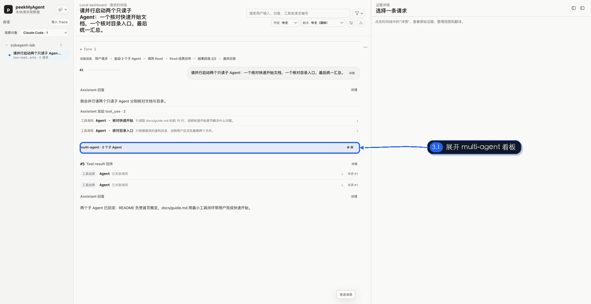

# 看懂子 Agent 与多 Agent 协作

多 Agent 调试最容易丢失三个关系：谁启动了谁、子 Agent 自己经历了哪些请求、结果何时回到主 Agent。PMA 的多 Agent 看板把这三层证据放在同一个用户 Turn 内。



演示使用真实 PMA Viewer、确定性 Anthropic Messages 假上游和 Claude 主题。主 Agent 同时启动“核对快速开始”和“核对目录入口”两个 Explore 子 Agent；第一个子 Agent 内部又调用一次 `Read`，两个结果最终在主请求 #5 回流。

## 先看机制流程

Turn 顶部的机制流程会概括：

```text
用户请求
  → 启动 2 个子 Agent
  → 子 Agent 调用 Read
  → Read 结果回传
  → 结果回流 2/2
  → 主 Agent 最终回答
```

这条流程用于快速建立因果顺序，不替代下面的完整请求证据。

## 展开 multi-agent 看板

看板默认折叠，避免长 Trace 一开始就渲染所有子分支。展开后：

- 顶部每个标签对应一个稳定子 Agent 实例；
- 标签名称优先使用真实 spawn nickname、description 或分支 label；
- 颜色和几何 glyph 共同标识身份，不能只靠颜色；
- 状态显示运行中、已完成或已回流等可证明结果；
- 一次只渲染当前选中分支，切换标签查看其他子 Agent。

## 子 Agent 内部仍是完整请求链

选中分支不会只显示一句摘要。它复用主时间线的请求卡片，保留：

- 子任务输入；
- System、Tools、History 与模型参数；
- Assistant 回复与 thinking 摘要；
- 工具调用、结果及来源跳转；
- 每次子请求的详情和 Raw。

因此可以分别回答“主 Agent 为什么派它出去”和“它自己为什么得出这个结论”。

## 父级启动与结果回流

看板下方的“父级启动与回流证据”用于回到：

- 主 Agent 产生 spawn / Agent 工具调用的请求；
- Harness 返回启动回执的位置；
- 子 Agent 结果进入主 Agent 上下文的请求。

如果只捕获到 spawn，没有捕获子 Agent 的模型请求，PMA 应显示空态并保留已知关联，不能伪造子请求内容。

## PMA 如何建立分支

不同 Harness 的证据不同：

- Claude Code 可以使用 `x-claude-code-agent-id`、debug source、父级 `Agent` tool use 与 tool result id；
- Codex 精确捕获可以使用子线程 id、`spawn_agent` 回执、`wait_agent` 或子 Agent 通知；
- 只有请求体的 Capture 可以在条件满足时通过父级 prompt 与子分支首条真实 user prompt 建立受限匹配。

强关联证据和推断证据必须在 Viewer 中保持可区分。没有实例 id、失败的启动回执或单纯自然语言提到“子 Agent”，都不能自动变成真实分支。

## 多轮与嵌套子 Agent

同一子 Agent 的多次模型请求使用独立上下文链，不能与主 Agent 或其他子 Agent 做 Context Delta。嵌套子 Agent 只有在 spawn/wait 工具和完整结果提供明确 JSON 时才闭合关系。

调试嵌套协作时按以下顺序：

1. 在主 Turn 找到第一次 spawn；
2. 展开分支并确认 child request index；
3. 查看 child 是否再次 spawn；
4. 沿 return / notification 回到上一级；
5. 最后检查主 Agent 最终回答是否使用了回流结果。

## Harness 差异边界

通用 OpenAI / Anthropic 协议桥只能证明 HTTP 交换被捕获，不自动证明某个自研 Harness 的父子 Agent 语义。只有专用 adapter 或稳定证据包确认后，PMA 才应展示 Harness 特有关系。

## 本章复核清单

- 分支是否来自真实 spawn 证据；
- 每个标签是否对应稳定实例，而不是显示顺序；
- 子 Agent 请求是否从主时间线去重；
- 结果是否确实回到主 Agent；
- 没捕获到的 child payload 是否明确显示未知或空态；
- 最终汇总是否与各分支结果一致。
