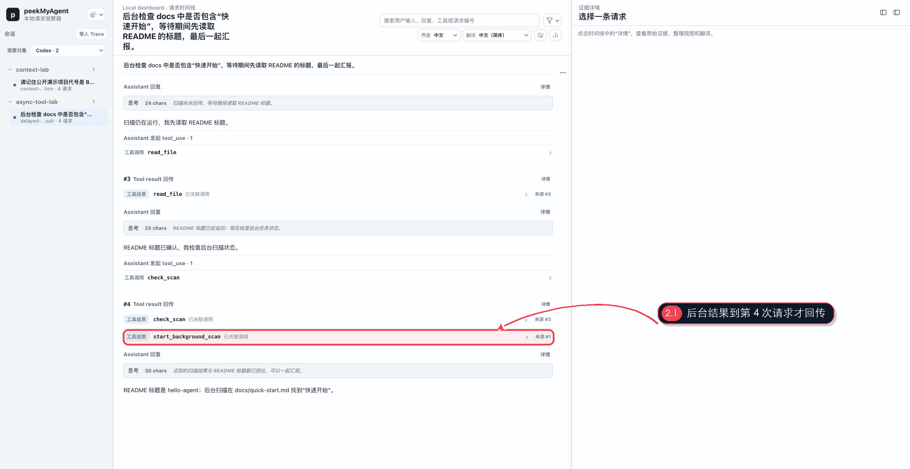

# 看懂工具调用、工具结果与迟到回传

工具闭环不是一条日志，而是跨多次模型请求形成的因果链：模型先看到工具定义，再产生工具调用；Harness 执行工具；结果随后作为新的上行内容回到模型；模型才据此继续或作答。

演示中的 `start_background_scan` 在请求 #1 发起。等待期间，Agent 又读取 README 并检查扫描状态；直到请求 #4，扫描结果才回传。PMA 仍然通过 call id 把结果标记为已关联调用，并提供 `来源 #1`。

## 四层证据

查看工具行为时按以下顺序核对：

1. **工具声明**：`Tools` 中是否真的有这个工具，参数 schema 和必填字段是什么；
2. **模型调用**：Assistant 回复中实际选择了哪个工具、call id 和参数是什么；
3. **Harness 结果**：后续请求中回传了什么文本或结构，是否发生截断或错误；
4. **模型使用**：最终回答是否与回传内容一致，还是忽略、曲解或重复调用。

只看到第 2 层不能证明工具执行成功；只看到终端输出也不能证明相同内容真的回到了模型。

## 展开工具调用

点击时间线中的工具调用，可以查看：

- 工具名称与语义类型；
- call id / tool use id；
- 参数对象；
- 这次调用属于主 Agent 还是某个子 Agent；
- 对应请求的完整证据和 Raw 位置。

工具名称来自协议原文。PMA 可以把已验证的工具语义整理为更易读的标题，但不会把未知工具硬归类为已知机制。

## 展开工具结果

工具结果通常出现在**下一次或更晚的请求**中。结果卡片的 `已关联调用` 表示 PMA 找到了稳定 call id 对应关系；`来源 #N` 会跳回产生调用的请求。

推荐操作：

1. 在结果卡片中确认实际回传内容；
2. 点击 `来源 #N` 回到原始调用并核对参数；
3. 使用返回操作回到结果；
4. 再查看结果之后的 Assistant 回复，判断模型如何使用它。

## 为什么迟到结果值得单独检查

在异步工具、后台任务或多 Agent 场景中，调用和结果之间可能夹着多次模型请求。普通日志需要手工搜索 id，并容易把两个相似工具调用配错。PMA 的来源跳转把“何时发起、何时回传、回到哪个上下文、模型随后做什么”放进同一条 Trace。

如果 Viewer 没有显示 `已关联调用`：

- 先在 Raw 中确认调用和结果是否携带同一个 id；
- 检查 adapter 是否完整捕获了产生调用的请求；
- 确认结果不是 Harness 自然语言总结，而是真实协议 tool result；
- 将它记录为证据缺失或 adapter 反馈，不要靠文本相似度宣称精确关联。

## 并行工具与顺序

请求参数中的 `parallel_tool_calls` 只表示模型接口允许或声明并行，不证明 Harness 最终并行执行。判断实际行为还要看多个调用的产生顺序、结果到达时间和 Harness 事件。

协议视图保留厂商原生 input/messages 顺序。摘要时间线为了阅读会合并一些重复信息，但 Raw 仍是精确字段的事实源。

## 大型结果与按需载荷

大型工具结果可能按需加载或显示预览。看到折叠、字符数或省略提示时：

- 点击详情请求完整载荷；
- 到 Raw Inspector 搜索 call id；
- 区分“Viewer 尚未加载”和“Capture 本身已截断”；
- 不要仅凭预览断言结果完整。

## 本章复核清单

- 工具是否真的声明给模型；
- 调用参数与 call id 是什么；
- 结果是否真实回到后续模型请求；
- `来源 #N` 是否指向正确调用；
- 最终回答是否使用了这份结果；
- 任何并行、异步或截断结论是否有原始证据。
