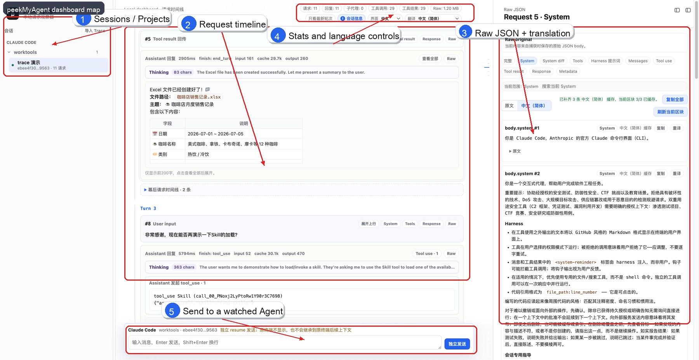

# peekMyAgent 图文使用说明

这篇文档用于给第一次接触 peekMyAgent 的用户快速说明：它不是一个新的聊天客户端，而是一个本地优先的 Agent Trace 观察工具。你仍然在 Claude Code、OpenClaw 等工具里工作，peekMyAgent 负责把模型请求链路整理成可以复盘的时间线。

## 一张图看懂


静态标注图：



## 两段核心流程

普通聊天的上行上下文拆解：


基础工具调用闭环：


图中 5 个区域分别对应日常调试中最常用的动作：

1. **Sessions / Projects**：左侧按项目和会话组织记录，方便在不同 Agent 会话之间切换。
2. **Request timeline**：中间按时间展示用户输入、模型回复、tool_use、tool_result、子 Agent 回流等事件。
3. **Raw JSON + translation**：右侧展示原始 JSON、结构化分段和翻译后的 System / Tools / Messages 等内容。
4. **Stats and language controls**：顶部展示请求数量、回复数量、工具调用数量、Raw 大小，并可以切换界面语言和翻译目标语言。
5. **Send to a watched Agent**：底部输入框可以向当前监听的 Agent 发送消息；它是独立发送入口，原终端不会显示这条消息，也不会继承原终端后续上下文。

## 最短使用路径

安装并打开 dashboard：

```bash
git clone https://github.com/fengjikui/peekMyAgent.git
cd peekMyAgent
node scripts/install.mjs
pma open
```

在你的项目目录里通过 peekMyAgent 启动 Claude Code：

```bash
cd <your-project>
pma claude -c
```

如果你明确想跳过 Claude Code 权限确认，把 Claude Code 自己的参数放在 `claude` 后面：

```bash
pma claude -c --dangerously-skip-permissions
```

之后正常使用 Claude Code。每次模型请求都会出现在 dashboard 中，你可以点击请求卡片上的 `System`、`Tools`、`Messages`、`Tool use`、`Tool result`、`Response` 或 `Raw` 查看对应切片。

## 适合演示的 4 个场景

### 1. 看清 Agent 实际发给模型的内容

推荐提示词：

```text
请简单介绍一下这个项目，并列出你准备先查看哪些文件。
```

演示重点：

- 中间时间线会出现用户输入和模型回复。
- 点击 `展开上行` 可以看到本次上行请求的组成。
- 点击 `System` / `Tools` / `Messages` 可以拆开查看上下文、工具 schema 和历史消息。
- 右侧 Raw 面板保留原始结构，适合排查“到底是谁注入了这段内容”。

### 2. 观察工具调用链路

推荐提示词：

```text
请查看当前目录有哪些文件，并读取 README 的开头部分。
```

演示重点：

- 模型回复中会出现 `tool_use`。
- 后续请求会出现 `tool_result` 回传。
- peekMyAgent 会把工具调用和结果按轮次串起来，便于复盘工具是否被正确调用、结果是否被带回模型。

### 3. 查看 System / Tools 的中文翻译

推荐操作：

1. 在右侧 Raw 面板点击 `System` 或 `Tools`。
2. 切换到 `中文`。
3. 如缓存缺失，点击刷新当前区块。

演示重点：

- 翻译按块缓存，避免每次重新翻译整段大提示词。
- 工具描述和参数描述分开展示，适合理解 Agent 能用哪些工具、每个工具的参数 schema 是什么。
- 翻译用于阅读辅助，不替代原始 JSON；需要精确排查时仍可回到 `原文`。

### 4. 展示子 Agent / 多 Agent 回流

推荐提示词：

```text
请同时启动两个子 Agent：一个统计当前目录文件，一个查看系统信息。完成后汇总结果。
```

演示重点：

- 时间线会标记子 Agent 请求、子 Agent 结果回流和主 Agent 后续总结。
- 多 Agent 面板用于看整体信息流：哪个子 Agent 被启动、何时返回、返回后主 Agent 如何继续。
- 这能帮助用户理解 Agent harness 的内部编排，而不只是看到最终自然语言答案。

## README GIF 录制大纲

如果只录一个总览 GIF，建议 12-18 秒：

1. 打开 dashboard，左侧选中一个 demo trace。
2. 点击中间一条请求的 `System`。
3. 在右侧从原文切到中文翻译。
4. 回到中间点击一条含 `tool_use` 的回复。
5. 最后停在右侧 Raw / Tools schema 面板，显示“原始数据 + 结构化解释”。

推荐输出文件：

```text
assets/demo/hero-agent-trace.gif
```

如果拆成多个短 GIF，建议：

- `assets/demo/raw-sections.gif`：System / Tools / Messages / Response / Raw 面板切换。
- `assets/demo/subagent-flow.gif`：多 Agent 面板和子 Agent 结果回流。
- `assets/demo/translation-tools.gif`：工具描述、参数描述、中文缓存与重译按钮。
- `assets/demo/share-trace.gif`：导出 Trace、导入 Trace、离线查看。

macOS 可以先用系统录屏得到 `.mov`，再用 ffmpeg 转 GIF：

```bash
ffmpeg -i recording.mov -vf "fps=12,scale=960:-1:flags=lanczos,split[s0][s1];[s0]palettegen[p];[s1][p]paletteuse" assets/demo/hero-agent-trace.gif
```

如果安装了 `gifski`，可以用它做更高质量的 GIF 压缩；如果没有，ffmpeg 已经足够完成 README 级别的素材。

## 素材制作工具链

- 截图标注：[Pillow `ImageDraw`](https://pillow.readthedocs.io/en/stable/reference/ImageDraw.html) 适合自动加红框、箭头、编号和标签。
- 自动网页截图：[Playwright `page.screenshot()`](https://playwright.dev/docs/screenshots) 适合后续稳定复现 dashboard 截图。
- GIF 转码：[ffmpeg](https://ffmpeg.org/ffmpeg-filters.html) 的 `palettegen` / `paletteuse` 流程适合控制 GIF 体积；[gifski](https://github.com/ImageOptim/gifski) 可作为质量更高的可选工具。

本次 README 素材使用 Pillow 从非敏感 demo 截图生成，未新增仓库运行依赖。

## 分享前检查

截图、GIF 和导出的 Trace 都可能包含：

- 私有源码、路径和文件名。
- system prompt、工具 schema、模型参数。
- 命令输出、工具结果和历史消息。
- API key 或 token 的片段。

公开分享前请优先使用专门准备的 demo 项目，并检查右侧 Raw 面板和时间线中是否出现敏感内容。
