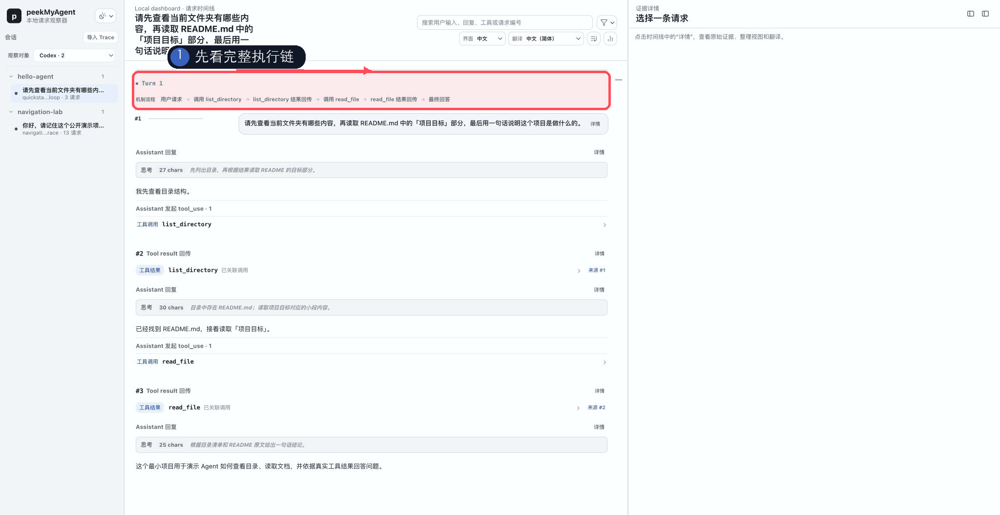
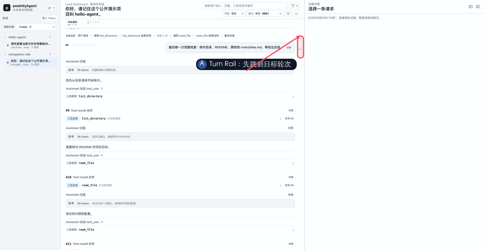

# peekMyAgent 图文与演示素材说明

这篇文档记录中文快速上手 v0.1 的演示设计、素材来源和重生成方式。它既是用户的图文导览，也是以后界面更新时重录素材的制作说明。

## 这支主 GIF 只回答一个问题

> PMA 如何让我从一条用户请求，一路追踪到工具调用、工具结果、最终回答和原始协议？



静态首帧：


主 GIF 不承担安装、子 Agent、上下文压缩、翻译和所有 Harness 差异的讲解。把太多概念塞进一条演示，会迫使第一次使用者先理解项目背景，反而看不清 PMA 的核心价值。这些主题将使用各自独立的短素材逐步补充。

## 演示场景

虚构测试目录：

```text
/demo/hello-agent/
├── README.md
├── data/
│   └── colors.json
└── notes/
    └── idea.md
```

用户请求：

```text
请先查看当前文件夹有哪些内容，再读取 README.md 中的「项目目标」部分，最后用一句话说明这个项目是做什么的。
```

确定性假模型产生三次 OpenAI Responses 请求：

1. 接收 System / Developer 指令、用户请求、模型参数和两项工具定义；调用 `list_directory({"path":"."})`。
2. 接收目录结果；调用 `read_file({"path":"README.md","start_line":1,"end_line":12})`。
3. 接收 README 内容；回答“这个最小项目用于演示 Agent 如何查看目录、读取文档，并依据真实工具结果回答问题。”

这个场景的优势是用户不需要理解任何业务规则。目录、读文件、依据结果回答都是直觉动作，注意力可以完全放在 Harness 如何组织请求，以及 PMA 如何关联证据上。

## 完整镜头脚本

| 镜头 | 用户动作 | 画面重点 | 要证明的价值 | 标注 | 停留 |
| --- | --- | --- | --- | --- | --- |
| 1. 完整执行链 | 选择演示会话 | 用户请求、两次工具调用、两次结果回传和最终回答 | 一屏先理解 Agent 做了什么 | 先快速扫一遍完整执行链 | 5.2 秒 |
| 2. System | 点击请求右侧的 `详情`，再选择右栏 `System` | `详情` 如何打开证据右栏；模型实际收到的系统指令 | 第一次使用者能把触发按钮与结果区域对应起来 | `2.1` 蓝框指向 `详情`；`2.2` 红框标出 System 内容 | 6.5 秒 |
| 3. 工具结果 | 点击 `list_directory` 的工具结果 | 左侧触发项与右侧实际回传内容 | 不只知道工具运行过，还能确认回传了什么 | `3.1` 蓝框标动作；`3.2` 红框标结果 | 7.5 秒 |
| 4. 来源调用 | 点击 `来源 #1` | Viewer 跳回原始 `function_call` 和参数 | 长会话中也能快速关联调用与迟到结果 | `4.1` 蓝框标来源按钮；`4.2` 红框标原始调用 | 7.5 秒 |
| 5. 最终回答 | 点击最终回复旁的 `详情` | 右栏 Response 与两项工具证据处于同一条链 | 用户可以检查回答是否真的基于文件内容 | `5.1` 蓝框标 `详情`；`5.2` 红框标原始回复 | 6.5 秒 |
| 6. 协议 | 打开一次请求的 `详情`，再点击 `协议视图` | 原生 input 顺序、工具、参数与回复 | 摘要不够时仍可核对完整上下行 | `6.1` 蓝框标 `详情`；`6.2` 蓝框标标签并用红框圈出协议内容 | 9.5 秒 |

总时长 42.7 秒。普通画面已超过 5 秒，复杂协议画面接近 10 秒；没有快速闪切，也没有无意义鼠标移动。

## 两级导航场景

主 GIF 之外还有一条独立长轨迹，专门回答：

> 当一次会话既有很多 Turn，某个 Turn 内又有很多 Request 时，怎样快速定位？



轨迹包含 6 个 Turn、13 个 Request，各轮请求数为 `1、1、3、2、5、1`。前两轮只做简单聊天，第三轮产生三次请求，第五轮连续核对四份公开证据并产生五次请求。镜头先标出右侧全局 Turn Rail，再标出中栏顶部只属于 Turn 5 的 Request Rail，每帧分别停留 6.5 秒和 7.5 秒。

## 画面规范

- 视口固定为 2048×1056。验收依据不是文件像素本身，而是三栏信息密度：右侧九个详情标签完整显示后仍保留明显空白，正文在 README 缩放后仍可辨认。
- Codex 场景使用 Codex 主题；未来 Claude Code 场景使用 Claude 主题。
- 暗夜主题只在主题切换说明中出现，不为每个教程重复录制一套。
- 中文界面优先；英文和其他语言等中文版结构稳定后再翻译。
- 蓝色只表示“点击这里”，红色只表示“随后查看这里”；同一镜头最多保留两步动作和一个结果区。
- 箭头使用带白色描边的短曲线，优先沿留白区域连接，不穿过正文；标注卡片不能遮挡被点击按钮、当前标签或关键内容。
- 主 GIF 是基于真实 Viewer 状态的慢速逐帧演示，不伪造产品中不存在的 UI。

## 逐帧视觉验收门禁

每一条箭头在写入生成脚本前，必须先留下一个最小草稿，至少回答四个问题：

1. **从哪里出发**：标注卡片准备放在哪块留白中？
2. **指向哪里**：终点是按钮、标签还是结果区域的哪一条边？箭头不能落在文字中心。
3. **怎样走线**：水平、垂直还是一条浅曲线？控制点要明确，不能完全交给自动布局碰运气。
4. **哪些地方不能经过**：用户消息、模型回复、参数值、当前标签和其他可能需要阅读的证据都属于禁行区。

生成脚本成功退出不等于素材通过验收。每次生成或局部重录后，制作者必须真实打开并审视每一张标注图，而不是只看文件列表或尺寸；至少完成两次检查：

- **完整分辨率检查**：以原始 2048×1056 查看，确认框线、箭头端点、阴影和文字边缘没有偏移或锯齿异常。
- **README 显示宽度检查**：缩放到 GitHub README 中接近 900～1100 像素的实际宽度，确认编号、短文案和目标控件仍然可辨认。

逐帧检查清单：

- 编号在圆形或胶囊徽标中是否水平、垂直居中；`2.1` 等多字符编号是否有足够左右留白；
- 标注文案在整张卡片中是否视觉居中，基线是否一致；
- 蓝色是否只标点击动作，红色是否只标随后查看的结果；
- 箭头终点是否落在控件或结果框的边缘，没有压住按钮文字和关键值；
- 箭头路径是否穿过任何用户可能想阅读的内容；
- 标注卡片是否遮住当前标签、按钮、标题、用户消息或协议字段；
- 画面缩小后是否仍能在一次停留时间内理解“点哪里、看哪里”；
- 自己是否愿意把这一帧放到产品首页。如果答案不是明确的“是”，就只调整该帧并重新生成、重新检查。

建议在制作记录中为每一帧保留 `通过 / 需调整 / 调整后通过` 状态，以及一句实际发现的问题。界面更新后重录时，必须重新走完这套检查，不能沿用旧结论。

### 当前版本复核记录

2026-07-31 对 `01`～`07` 完成了 2048×1056 原图与 1024 像素宽 README 预览的逐帧复核。编号和文案在圆形或胶囊标记中均已调整后通过；所有箭头均落在控件或结果框边缘，并避开需要阅读的正文。`02` 和 `06` 的右栏提示卡会占用少量次要筛选栏留白，但没有遮挡被点击的标签、System 内容、协议标题或协议字段，当前版本接受这一取舍。其余帧未发现内容遮挡或指向歧义。界面或标注文案变化后，这条记录自动失效，必须重新验收。

## 素材与来源

发布素材：

- `assets/demo/quickstart-tool-loop.gif`：README 首屏主 GIF。
- `assets/demo/quickstart-overview.png`：无标注静态总览。
- `assets/demo/quickstart-overview-annotated.png`：带单一引导标注的静态总览。
- `assets/demo/quickstart/01-trace.png` ～ `06-protocol.png`：工具闭环章节图。
- `assets/demo/two-level-navigation.gif`：Turn / Request 两级导航慢速说明。
- `assets/demo/quickstart/07-two-level-navigation.png`：两级导航静态标注图。

原始素材：

- `assets/demo/source/quickstart/*-raw.png`：真实 Viewer 原始帧。
- `assets/demo/source/quickstart/manifest.json`：源提交、视口、主题、场景、隐私检查、生成命令和帧时长。
- `assets/demo/source/navigation/`：6 Turn / 13 Request 长轨迹的原始帧和 manifest。

旧版 `dashboard-overview-tour.gif`、`chat-upstream-context.gif` 和 `tool-call-loop.gif` 暂时保留，供比较与后续迁移；中文版 README 首屏已不再使用它们。

## 重生成演示轨迹

启动确定性假上游和 PMA：

```bash
node scripts/readme-media-demo.mjs --port 43112
```

脚本会打印短轨迹和长轨迹两个 Source URL。用浏览器打开对应 URL，将视口设为 2048×1056，切换中文与 Codex 主题，按镜头脚本操作真实 Viewer。短轨迹的六个状态保存到：

```text
assets/demo/source/quickstart/quickstart-overview-raw.png
assets/demo/source/quickstart/quickstart-system-raw.png
assets/demo/source/quickstart/quickstart-tool-result-raw.png
assets/demo/source/quickstart/quickstart-tool-origin-raw.png
assets/demo/source/quickstart/quickstart-final-raw.png
assets/demo/source/quickstart/quickstart-protocol-raw.png
```

长轨迹选择 Turn 5，确认 Request Rail 显示 `#8 · 1 / 5` 后，将状态保存为：

```text
assets/demo/source/navigation/two-level-navigation-raw.png
```

重新生成标注图和 GIF：

```bash
python3 scripts/build-readme-media.py
```

脚本使用 Pillow 确定性添加红框、箭头、编号和中文字幕，没有新增产品运行依赖。需要发布视频时，可以直接复用这些原始帧、镜头文案和时长，在 ffmpeg、剪映或其他剪辑工具中生成 MP4、字幕和配音，不必重新设计故事。

## 隐私边界

本次演示只使用：

- 虚构的 `/demo/hello-agent` 路径；
- 虚构文件名和内容；
- 确定性本地假上游；
- 假认证值，且 Viewer 中显示为脱敏值；
- 本地环回地址，不向外部模型或网络服务发送请求。

公开分享新素材前必须逐帧检查 Source 名称、System、Tools、Raw、路径、命令输出和历史消息。不要录制真实 API Key、真实提示词、用户源码、本地隐私路径或不可公开的 Capture。

## 后续素材优先级

在主 GIF 与五分钟快速上手通过用户审阅后，再独立制作：

1. Claude Code 主题下的子 Agent 启动、结果回流与主 Agent 汇总；
2. 上下文变化与压缩前后对比，并明确区分各 Harness 的真实实现；
3. 异步工具结果跨多轮回传和来源定位；
4. System / Tools 分块翻译；
5. 自研 Harness 通过 OpenAI / Anthropic 通用桥接入；
6. 一支可配字幕和旁白的中文视频。

每个新主题仍只回答一个核心问题，并先用真实产品证据确认功能存在，不能把 roadmap 写成已实现。
