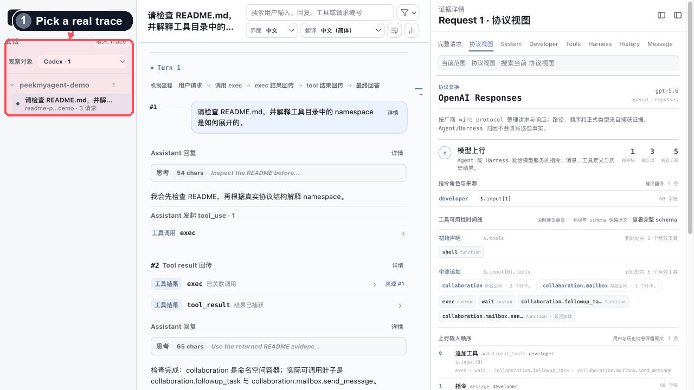
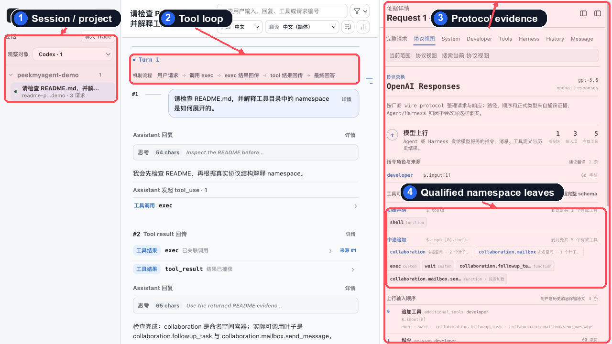
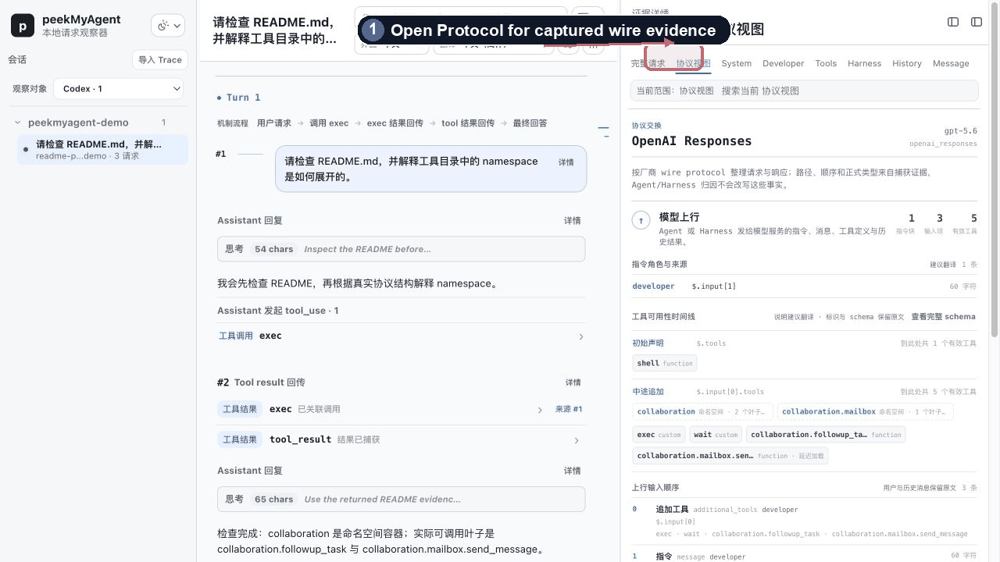
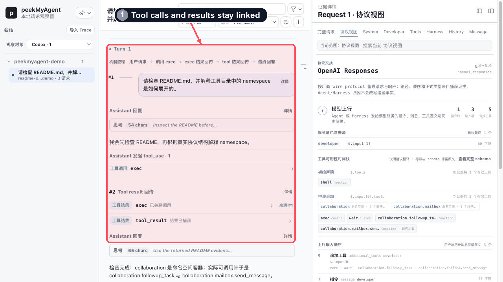

# peekMyAgent 图文使用说明

这篇文档用于给第一次接触 peekMyAgent 的用户快速说明：它不是一个新的聊天客户端，而是一个本地优先的 Agent Trace 观察工具。你仍然在 Claude Code、OpenClaw 等工具里工作，peekMyAgent 负责把模型请求链路整理成可以复盘的时间线。

## 一张图看懂



静态标注图：



## 两段核心流程

协议顺序与 namespace 工具目录：



工具调用闭环与懒加载：



图中 4 个标注区域对应当前最关键的观察动作：

1. **Session / project**：左侧按项目和会话组织记录，并按 Agent 隔离观察对象。
2. **Tool loop**：中间的机制流程与时间线把用户请求、工具调用、结果回传和最终回答串成一条可追溯链路。
3. **Protocol evidence**：右侧按厂商 wire protocol 原顺序展示上行、下行、工具阶段及对应 Raw 路径。
4. **Qualified namespace leaves**：namespace 容器保留层级身份，实际可调用叶子使用 `collaboration.followup_task` 这类限定名；容器不再被误算为零参数工具。

第二段 GIF 还展示了大型结果和图片的按需加载：默认只进入浏览器一行 MIME、大小、token 估算、尺寸与 hash 占位，用户点击后才从本地 Viewer 读取正文或还原安全 raster 图片。

## 最短使用路径

安装并打开 dashboard：

```bash
git clone https://github.com/fengjikui/peekMyAgent.git
cd peekMyAgent
node scripts/install.mjs
pma open
```

在你的项目目录里通过 peekMyAgent 启动 Claude Code：

```bash
cd <your-project>
pma claude -c
```

如果你明确想跳过 Claude Code 权限确认，把 Claude Code 自己的参数放在 `claude` 后面：

```bash
pma claude -c --dangerously-skip-permissions
```

之后正常使用 Claude Code。每次模型请求都会出现在 dashboard 中：点击请求或回复旁的 `详情`，再从右侧选择 `协议视图`、`System`、`Developer`、`Tools`、`History`、`Message` 或 `Metadata`；也可以直接点时间线里的工具调用/工具结果行追踪关联关系。

## 适合演示的 4 个场景

### 1. 按真实协议顺序看清 Agent 发了什么

推荐提示词：

```text
请简单介绍一下这个项目，并列出你准备先查看哪些文件。
```

演示重点：

- 中间时间线会出现用户输入和模型回复。
- 点击用户请求旁的 `详情`，打开右侧 `协议视图`。
- OpenAI Responses、OpenAI Chat、Anthropic Messages 和 Google GenerateContent 都按自己的原生顺序展示，不根据 Agent 名称猜测协议。
- 每个条目都保留 Raw 路径；需要精确排查时可以直接跳回原始证据。

### 2. 观察工具调用链路

推荐提示词：

```text
请查看当前目录有哪些文件，并读取 README 的开头部分。
```

演示重点：

- 模型回复中会出现工具调用，后续请求会出现结果回传。
- 机制流程和“来源 #N”把调用、结果与最终回答串起来。
- 大于阈值的结果先显示类型、大小、token 估算与 hash，只有点击 `加载内容` 才读取本地正文。

### 3. 查看 System / Tools 的中文翻译

推荐操作：

1. 在右侧 Raw 面板点击 `System` 或 `Tools`。
2. 切换到 `中文`。
3. 如缓存缺失，点击刷新当前区块。

演示重点：

- 翻译按块缓存，避免每次重新翻译整段大提示词。
- 工具描述和参数描述分开展示，适合理解 Agent 能用哪些工具、每个工具的参数 schema 是什么。
- 翻译用于阅读辅助，不替代原始 JSON；需要精确排查时仍可回到 `原文`。

### 4. 展示子 Agent / 多 Agent 回流

推荐提示词：

```text
请同时启动两个子 Agent：一个统计当前目录文件，一个查看系统信息。完成后汇总结果。
```

演示重点：

- 时间线会标记子 Agent 请求、子 Agent 结果回流和主 Agent 后续总结。
- 多 Agent 面板用于看整体信息流：哪个子 Agent 被启动、何时返回、返回后主 Agent 如何继续。
- 这能帮助用户理解 Agent harness 的内部编排，而不只是看到最终自然语言答案。

## README 素材与复现方式

当前 README 使用 3 个短 GIF：

- `dashboard-overview-tour.gif`：会话导航、工具闭环、Protocol、namespace 与懒加载总览。
- `chat-upstream-context.gif`：协议顺序、工具阶段和限定名叶子。
- `tool-call-loop.gif`：工具调用/结果关联、文本与图片按需加载。

制作前先固定“这支动图只回答什么问题”，再按下面的 storyboard 采集界面，不从一段长录屏里随机截取：

| 动图 | 用户问题 | 叙事顺序 | 节奏 |
| --- | --- | --- | --- |
| 总览 | 一条本地 Trace 能让我看懂什么？ | 选择会话 -> 工具闭环 -> 厂商原生协议 -> namespace 叶子 -> 大载荷懒加载 | 5 帧，约 17 秒 |
| 协议与 namespace | PMA 如何忠实解析不同协议和工具目录？ | 打开 Protocol -> declared/added/loaded 阶段 -> 容器不是工具 -> 叶子 schema | 4 帧，约 14 秒 |
| 工具闭环与懒加载 | 大 Trace 如何既完整又不拖慢首屏？ | 调用/结果关联 -> 占位元数据 -> 按需加载正文 -> 图片保持本地 | 4 帧，约 14 秒 |

每帧只保留一个红框和一句结论；导航帧至少停留 2.8 秒，需要阅读结构或字段的帧停留 3.4-3.8 秒。总时长控制在 12-18 秒，既能看清，也适合 README 自动循环播放。

素材来自隔离、可复现的假 provider，不读取用户会话，也不向外部服务发请求：

```bash
node scripts/readme-media-demo.mjs --port 43112
```

随后用浏览器在 `http://127.0.0.1:43112` 操作真实 Viewer，把关键状态保存到 `tmp/readme-media-frames/`。完成截图后运行：

```bash
python3 scripts/build-readme-media.py
```

脚本使用 Pillow 叠加确定性的红框、箭头、编号和说明，并按 storyboard 中的停留时间直接生成 `assets/demo/` 下的静态图与 GIF。当前输出为 1280×720，单个 GIF 控制在 1 MiB 内。

## 素材制作工具链

- 截图与交互：使用 Codex 内置 Browser 控制真实本地 Viewer，不读取浏览器历史、Cookie 或用户会话。
- 截图标注：`scripts/build-readme-media.py` 使用 Pillow `ImageDraw` 自动加红框、箭头、编号和标签。
- GIF 输出：Pillow 自适应调色板；需要视频发布物时仍可用 ffmpeg / gifski 做二次转码。

本次 README 素材使用浏览器真实截图与 Pillow 确定性标注生成，未新增产品运行依赖。

## 分享前检查

截图、GIF 和导出的 Trace 都可能包含：

- 私有源码、路径和文件名。
- system prompt、工具 schema、模型参数。
- 命令输出、工具结果和历史消息。
- API key 或 token 的片段。

公开分享前请优先使用专门准备的 demo 项目，并检查右侧 Raw 面板和时间线中是否出现敏感内容。
